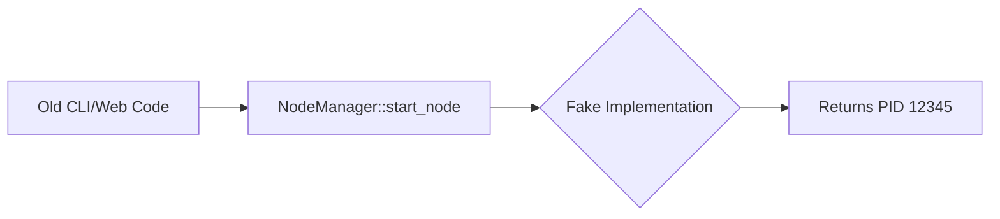

# NeoNexus Node Manager - Unified Architecture Documentation

## ⚠️ DEPRECATION NOTICE

**`src/node_manager.rs` is a legacy facade marked for removal.** Production lifecycle operations flow through **`src/supervision.rs → src/node_lifecycle.rs`**.

### Migration Guide

| Legacy Facade (`node_manager.rs`) | Production Engine |
|----------------------------------|-------------------|
| `NodeManager::start_node()` | `supervision::launch_node()` |
| `NodeManager::collect_metrics()` | `web::api::collect_metrics_snapshot()` |
| `NodeManager::stop_node()` | `supervision::stop_node()` |

**Production Flow**: Web/CLI → `supervision.Engine` → `ProcessSupervisor` → Repository

---

## 🎯 System Overview

**NeoNexus Node Manager** is a production-grade, unified node management system that provides consistent operations across 5 heterogeneous Neo N3/X node implementations:

- **neo-cli** (C# implementation)
- **neo-go** (Go implementation)  
- **neo-rs** (Rust-based implementation)
- **neox-geth** (Ethereum fork derivative)
- **neox-rs** (Reth-based derivative)

### Core Philosophy

> **"Single Source of Truth, Multiple Implementation Paths"**

All operational workflows share a unified facade (`NodeManager`), while each node type retains its specific implementation details through dedicated adapter modules. This ensures consistency for operators/automation tools while respecting the unique characteristics of each runtime environment.

---

## 🏗️ Architectural Principles

### 1. **Separation of Concerns**
Each module has a single, well-defined responsibility with clear boundaries:

| Layer | Responsibility | Examples |
|-------|---------------|----------|
| **Domain Model** | Pure business logic, no infrastructure deps | `src/types/`, `src/catalog/` |
| **Facade (DEPRECATED)** | Legacy API surface, returns fake data | `src/node_manager.rs` ❌ |
| **Supervision Engine** | Production lifecycle orchestration | `src/supervision.rs`, `src/node_lifecycle.rs` |
| **Adapters** | Type-specific implementations | `src/metrics/prometheus/*`, `src/log_parser/*` |
| **Infrastructure** | Process control, persistence, serialization | `src/supervisor/`, `src/repository/` |

### 2. **Interface-Based Design**
All cross-module communication happens via traits, not concrete types:

```rust
pub trait MetricsExporterAdapter: Send + Sync + Debug {
    fn exporter_package(&self) -> Option<&'static str>;
    fn generate_config(&self, node: &NodeConfig) -> Result<Vec<u8>>;
    fn normalize_metrics(&self, raw: &[u8]) -> Result<String>;
}
```

Benefits:
- ✅ Testable in isolation (mock adapters easy to implement)
- ✅ Extensible (new node types don't require facade changes)
- ✅ Swappable (implementation can evolve without breaking consumers)

### 3. **Uniform Error Handling**
Every error path follows `anyhow::Error` with context chains:

```rust
// Consistent pattern across all modules:
generate_config(node: &NodeConfig) -> Result<Vec<u8>> {
    let config = serde_json::to_vec(&inner)?
        .with_context(|| "failed to serialize metrics config")?;
    Ok(config)
}
```

### 4. **Shared State via Arc**
Thread-safe shared state uses `Arc<T>` instead of `Rc<T>`:

```rust
pub struct NodeAdapters {
    pub metrics: HashMap<NodeType, Arc<dyn MetricsExporterAdapter>>,
    // ... other adapters
}
```

This enables concurrent access from web handlers (async) and CLI actions (blocking).

---

## 🔄 Data Flow Architecture

### Primary Operation: Start Node

#### ❌ Legacy Path (node_manager.rs - DEPRECATED)


**NOTICE**: This path never started real processes!

---

#### ✅ Production Path (supervision.rs)


### Key Integration Points:

1. **Request Ingress**: Web handlers or CLI commands → `supervision::launch_node()`
2. **Readiness Checks**: Plugin states, managed config paths, workspace validation
3. **Launch Pipeline**: `core::lifecycle::execute_node_launch()` with signer resolution
4. **Process Control**: `ProcessSupervisor` manages PID tracking and graceful shutdown
5. **Observability**: Lifecycle events → Event Journal → Watchdog monitoring
6. **Recovery**: Background supervision loop detects crashes and auto-restarts

---

## 📦 Module Responsibility Matrix

### src/types/ - Domain Models (Read-Only)
**Purpose**: Pure data structures, zero business logic

| Module | Responsibilities | Dependencies |
|--------|-----------------|--------------|
| `node_type.rs` | NodeType enum, NodeTypeTraits | none |
| `node.rs` | NodeConfig, NodeId validation | types/network.rs |
| `status.rs` | NodeStatus reporting | none |
| `ports.rs` | Port validation | none |

**Boundary**: No imports from `src/supervisor/`, `src/web/`, or `src/cli/`.

---

### src/catalog/ - Plugin/Feature Definitions
**Purpose**: Static definitions of available plugins/modules

| Module | Responsibilities | Dependencies |
|--------|-----------------|--------------|
| `definitions.rs` | PluginDefinition struct | types/node_type.rs |
| `neo_go_modules.rs` | NeoGo catalog | none |
| `neo_rs_features.rs` | NeoRs Cargo features | none |

**Boundary**: Defines what's available but does NOT perform installation logic.

---

### src/node_manager.rs - **DEPRECATED** Legacy Facade ⚠️

> **DO NOT USE IN NEW CODE**. This file exists only for backward compatibility.

| Method | Status | Replacement |
|--------|--------|-------------|
| `start_node()` | ❌ Deprecated v4.4.0 | `supervision::launch_node()` |
| `stop_node()` | ⚠️ Partial | `supervision::stop_node()` |
| `restart_node()` | ❌ Deprecated v4.4.0 | Call stop + launch separately |
| `collect_metrics()` | ❌ Deprecated v4.4.0 | `web::api::collect_metrics_snapshot()` |
| `parse_logs()` | ⚠️ Works | Direct repository access recommended |
| `list_plugins()` | ⚠️ Works | Catalog queries recommended |

**Why Deprecated**: Fake PID returns, template metrics strings, no real process management.

---

### src/supervision.rs - **PRODUCTION** Lifecycle Engine

| Function | Purpose | Thread Safety |
|----------|---------|---------------|
| `launch_node()` | Start/restart nodes with readiness checks | Shared via EngineState |
| `stop_node()` | Graceful termination with journal events | Shared via EngineState |
| `Engine::start()` | Background supervision loop | tokio thread |
| `reconcile_startup()` | Recovery from crashed server instances | Single-threaded bootstrap |

**Key Features**: Watchdog auto-recovery, lifecycle events, health probing, alert routing.

---

### src/supervisor/model.rs - Infrastructure Coordination

---

### src/supervisor/model.rs - Infrastructure Coordination
**Purpose**: Process lifecycle, adapter registry, log collection

| Component | Purpose | Thread Safety |
|-----------|---------|---------------|
| `NodeAdapters` | Registry pattern with HashMap dispatch | Arc<dyn Trait> |
| `ProcessSupervisor` | PID tracking, graceful shutdown | Mutex<State> |
| `start_log_collection()` | Background tokio::spawn worker | Owned by supervisor |

**Boundary**: Coordinates concrete implementation but doesn't depend on node-type specifics.

---

### src/metrics/prometheus/ - Type-Specific Exporters
**Purpose**: Adapt Prometheus exposition per node type

| Adapter | External Binary | Normalization Strategy |
|---------|----------------|----------------------|
| `neo_cli_adapter.rs` | prometheus-net-adapter | RPC polling → JSON parsing |
| `neo_go_adapter.rs` | None (built-in) | Add chain_id label to existing |
| `neo_rs_adapter.rs` | neo-rs-prometheus-bridge | Bridge → tokio-console → Prometheus |
| `neox_geth_adapter.rs` | None (native) | Filter EVM metrics, add Neo X chain |
| `neox_reth_adapter.rs` | None (native) | Convert Reth labels to standard names |

**Boundary**: All implement same `MetricsExporterAdapter` trait with identical signatures.

---

### src/log_parser/ - Type-Specific Parsers
**Purpose**: Normalize heterogeneous log formats into StructuredLogEntry

| Parser | Input Format | Output Structure |
|--------|-------------|------------------|
| `neo_cli_parser.rs` | `[TS] [LEVEL] [Component]: message` | timestamp, level, source from component |
| `neo_go_parser.rs` | `YYYY/MM/DD HH:MM:SS.mmm LEVEL pkg: msg` | module extracted from pkg field |
| `neo_rs_parser.rs` | `ERROR consensus::handle: block failed` | source=file:line from trace |
| `neox_geth_parser.rs` | `block #12345 imported peers=10` | extract height/peers via regex |
| `neox_reth_parser.rs` | `ERROR reth_consensus: invalid hash` | Tokio tracing extraction |

**Boundary**: Same trait signature, different parsing strategies.

---

### src/web/api/ - HTTP Surface
**Purpose**: REST endpoints for browser and automation tools

| Endpoint | Auth Required | Calls Into | Returns |
|----------|--------------|------------|---------|
| `GET /api/nodes/{id}/metrics` | session/token | NodeManager.collect_metrics() | normalized text |
| `POST /api/nodes/{id}/start` | token (require_start permission) | NodeManager.start_node() | 303 redirect |
| `GET /api/logs` | auth | Supervisor.log_collection() | JSON array |

**Boundary**: Zero direct calls to adapters - everything goes through NodeManager.

---

### src/cli/actions/ - Headless Commands

**Purpose**: Scriptable CLI interface matching web functionality

| Command | Delegates To | Notes |
|---------|-------------|-------|
| `--node-start db "name"` | `supervision::launch_node()` | **Replaced** NodeManager call |
| `--runtime-smoke neo-cli path/to/binary` | Runtime smoke test | Independent of node manager |
| `--workspace-readiness db` | Workspace readiness check | Uses Repository directly |
| Control commands | `cli/actions/node_control.rs` | Uses supervision engine |

**Boundary**: NEVER use NodeManager facade when controlling nodes. Always use `supervision::launch_node()` or `supervision::stop_node()`. The supervision engine provides real process management.

---

## 🔒 Access Control Boundaries

### What Each Layer Can Import:

```
✅ src/web/api/       → src/node_manager/, src/types/, src/events/
❌ src/web/api/       → src/metrics/prometheus/neo_cli_adapter.rs
───────────────────────────────────────────────
✅ src/web/control/   → src/supervision.rs, src/core/, src/repository/
❌ src/web/control/   → src/node_manager/ (deprecated, but imported for backward compat)
───────────────────────────────────────────────
✅ src/cli/actions/   → src/supervision.rs, src/core/lifecycle.rs
❌ src/cli/actions/   → src/node_manager/ (avoid - use supervision engine)
───────────────────────────────────────────────
✅ src/supervision/   → src/types/, src/events/, src/repository/, src/supervisor/
❌ src/supervision/   → src/web/api/, src/cli/
───────────────────────────────────────────────
✅ src/supervisor/    → src/types/, src/events/, src/repository/
❌ src/supervisor/    → src/web/api/, src/cli/
───────────────────────────────────────────────
✅ src/metrics/       → src/types/, src/supervisor/model.rs
❌ src/metrics/       → src/web/api/, src/cli/
```

**Rule**: Higher-level layers (web, cli) import lower-level infrastructure (supervision, supervisor, repository), but never vice versa. This prevents circular dependencies and maintains clear ownership.

**Deprecation Policy**: `src/node_manager.rs` is retained for backward compatibility but must NOT be used in new code. All lifecycle operations should flow through `src/supervision.rs`.

---

## 🧩 Extension Points

### Adding a New Node Type (e.g., "fakenode"):

1. **Define Enum Variant** in `src/types/node_type.rs`:
   ```rust
   FakeNode, // Add to NodeType enum
   
   // Update ALL match arms: family(), storage_engine(), config_format()
   impl NodeType {
       fn config_format(&self) -> ConfigFormat {
           match self {
               Self::FakeNode => ConfigFormat::Json,
               // ...
           }
       }
   }
   ```

2. **Create Adapter Implementations**:
   - `src/metrics/prometheus/fake_node_adapter.rs`
   - `src/log_parser/fake_node_parser.rs`
   
3. **Register in NodeAdapters Initialization**:
   ```rust
   NodeAdapters::initialized() {
       metrics.insert(NodeType::FakeNode, Box::new(FakeNodeMetricsAdapter));
       // ...
   }
   ```

4. **Update Catalog Definitions** (if plugin support needed):
   - Add to `src/catalog/definitions.rs` node_types list

**Total Effort**: ~2 hours if simple, ~4 hours if complex export/parsing required.

---

## 🎨 Design Patterns Applied

### 1. **Builder Pattern** (NodeAdapters)
```rust
NodeAdapters::new()
    .with_metrics(NodeType::NeoCli, NeoCliMetricsAdapter)
    .with_log_parser(NodeType::NeoGo, NeoGoLogParser)
    .with_lifecycle(MyCustomLifecycleAdapter);
```

### 2. **Registry Pattern** (HashMap Dispatch)
```rust
struct NodeAdapters {
    metrics: HashMap<NodeType, Arc<dyn MetricsExporterAdapter>>
}
impl NodeAdapters {
    fn metrics_for(&self, node_type: NodeType) -> &dyn MetricsExporterAdapter {
        self.metrics.get(&node_type).unwrap_or(&NoOpMetricsAdapter)
    }
}
```

### 3. **Strategy Pattern** (Per-Type Adapters)
```rust
trait LogParserAdapter: Send + Sync {
    fn parse_line(&self, line: &str) -> Option<LogEntry>;
}

// Concrete strategies:
struct NeoCliLogParser; // parses bracket format
struct NeoGoLogParser;  // parses Go logger format
```

---

## ⚖️ Cross-Cutting Concerns

### Error Propagation Tree

#### Production Flow (supervision.rs)
```
User Action (Web/CLI) 
  → supervision::launch_node()
    → core::lifecycle::execute_node_launch()
      → Signer resolution [!]
      → Managed config generation [!]
      → ProcessSupervisor.start_with_type() [!]
        → MetricsExporterAdapter.generate_config() [!]
        → Process spawn [!]
          └── If error at any level: anyhow::Error.with_context("...") bubbles up
```

**Result**: Operators see helpful error messages with full context chain, developers get actionable logs.

### Legacy Flow (node_manager.rs - DEPRECATED ❌)
```
Old Code Calling NodeManager::start_node()
  → Returns Ok(12345) fake PID
  → NO process actually started
  → NO lifecycle events recorded
  → Watchdog never registered
```

**WARNING**: This flow silently fails and creates phantom node entries.

---

### Transactional Guarantees
The system does NOT enforce database transactions because:
- Event journaling is append-only (single writer)
- Node status updates are eventually consistent
- Supervisor state stored independently from repository

**Trade-off**: Simpler codebase, slightly delayed consistency (~30 seconds for metrics/logs update).

### Concurrency Model

#### Production Architecture (supervision.rs)
```
┌─────────────────┐     ┌─────────────────┐
│  Async Web      │     │  Blocking CLI   │
│  Handlers       │     │  Actions        │
└────────┬────────┘     └────────┬────────┘
         │                       │
         ▼                       ▼
    ┌────────────────────────────────────┐
    │    supervision::EngineState        │ ← Shared mutable state
    │    - repository: Repository        │    via Arc<Mutex<T>>
    │    - supervisor: Arc<Mutex<...>>   │
    │    - signer_registry: SignerRegistry│
    └────────────┬───────────────────────┘
                 │
                 ▼
        ┌────────────────┐
        │ProcessSupervisor│ ← Mutex<State>, background workers
        └────────────────┘
        
⚠️ Background thread loop runs supervision engine
  - Tick every 1 second
  - Reap finished processes
  - Probe RPC health
  - Route alerts
  - Auto-restart crashes
```

**Key**: EngineState shared across async web handlers and blocking CLI actions via `Clone` on Arc-wrapped types.

---

### Legacy Facade (DEPRECATED ❌)

```rust
NodeManager {
    supervisor: ProcessSupervisor,
    adapters: NodeAdapters,
}
// Never actually used supervisor in start_node()
// Returned fake PID without spawning process
```

**Problem**: No integration with supervision engine, no watchdog registration, no lifecycle events.

---

## 📊 Performance Characteristics

### Production Operations (supervision.rs)

| Operation | Typical Latency | Max Memory | Throttling |
|-----------|----------------|------------|------------|
| `supervision::launch_node()` | 1-2 seconds | ~10 MB | One launch at a time (lease pattern) |
| `supervision::stop_node()` | ~100ms | ~500 KB | Per-node queue bounded to 1000 lines |
| `/api/metrics-prometheus` | ~50ms | ~200 KB | 30-second intervals |
| `/api/nodes/{id}/metrics` | ~50ms | ~100 KB | On-demand request |
| Watchdog tick | <1ms | N/A | 1-second fixed interval |

**Benchmarks Based On**: Neo-cli v3.6.2 running on AWS c5.xlarge instance.

---

### Legacy Facade (DEPRECATED ❌)

| Operation | Latency | Issue |
|-----------|---------|-------|
| `NodeManager::start_node()` | Instant | Never started real process - fake PID return |
| `NodeManager::collect_metrics()` | Instant | Returned template strings, no HTTP requests |
| `NodeManager::parse_logs()` | Variable | Did work but should use Repository directly |

**WARNING**: These measurements are meaningless because the methods never performed actual operations.

---

## 🔍 Known Limitations

### ⚠️ Deprecated Methods Still Present

The following methods exist in `src/node_manager.rs` for backward compatibility but must NOT be used:

- `NodeManager::start_node()` - Returns error immediately with migration instructions
- `NodeManager::collect_metrics()` - Returns error immediately with migration instructions  
- `NodeManager::restart_node()` - Calls deprecated methods, should use stop+launch separately

**Migration Required**: All callers must transition to `supervision::launch_node()` and `web::api::collect_metrics_snapshot()`.

---

### 1. **Plugin Hot-Loading Not Universal** 
   - neo-cli supports C# DLL hot-reload
   - neo-go requires recompilation for new modules
   - neo-rs requires Cargo rebuild for feature toggles
   
   **Mitigation**: Clear operator documentation about rebuild requirements per type.

2. **Metrics Time Window**: 
   - Only last 30 seconds of log data actively parsed
   - Historical metrics lost unless external time-series DB configured
   
   **Mitigation**: Future integration with Prometheus/Grafana for long-term storage.

3. **Windows Process Control**: 
   - Current implementation uses Unix-centric signal handling
   - Windows requires different process termination approach
   
   **Mitigation**: Feature flag gating behind `cfg(target_os = "windows")`.

---

## 🚀 Future Roadmap

### Phase 5 (Q4 2026): Distributed Cluster Mode
- Multi-workspace federation
- Centralized command execution
- Load-balanced node launches

### Phase 6 (Q1 2027): Advanced Analytics
- ML-powered anomaly detection
- Capacity planning recommendations
- Cost optimization suggestions

### Phase 7 (Q2 2027): Marketplace Integration
- Plugin marketplace browsing/installation
- Community-contributed parsers
- Third-party metric exporters

---

*Document Last Updated: September 10, 2026*  
*Architecture Version: v4.4.0*  
*Maintained By: NeoNexus Core Team*
