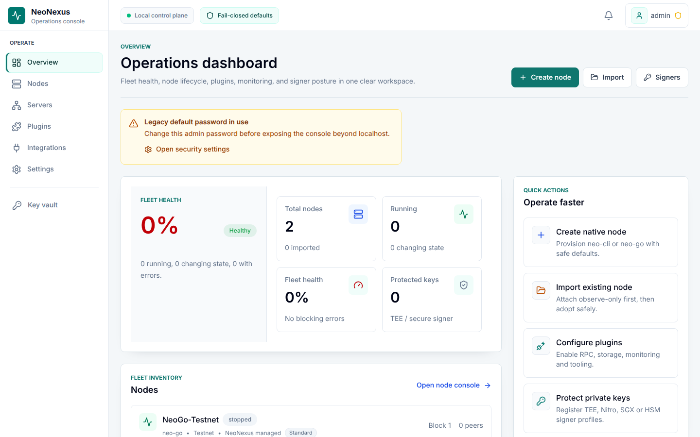
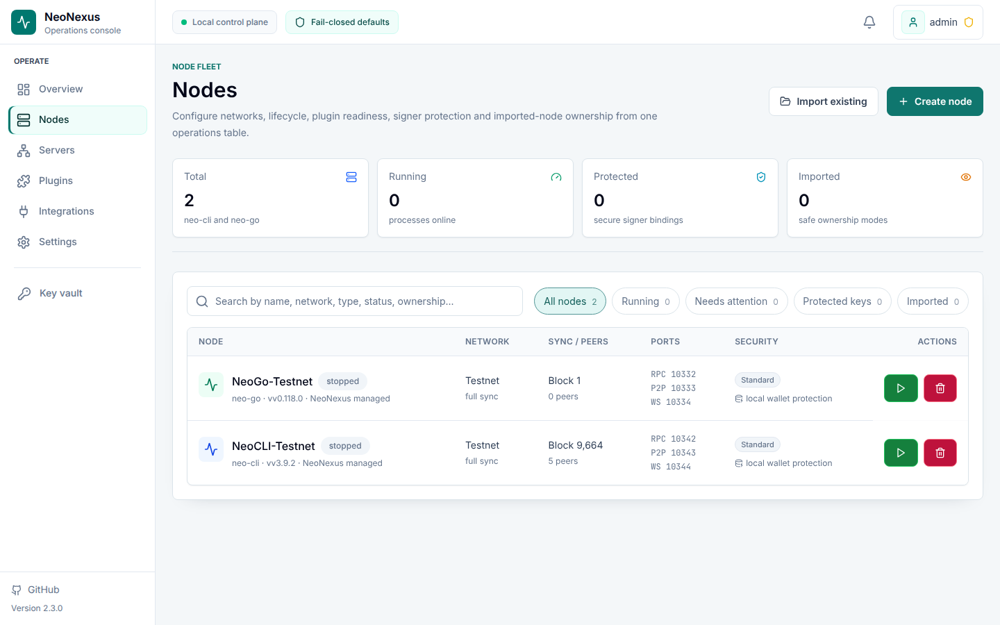
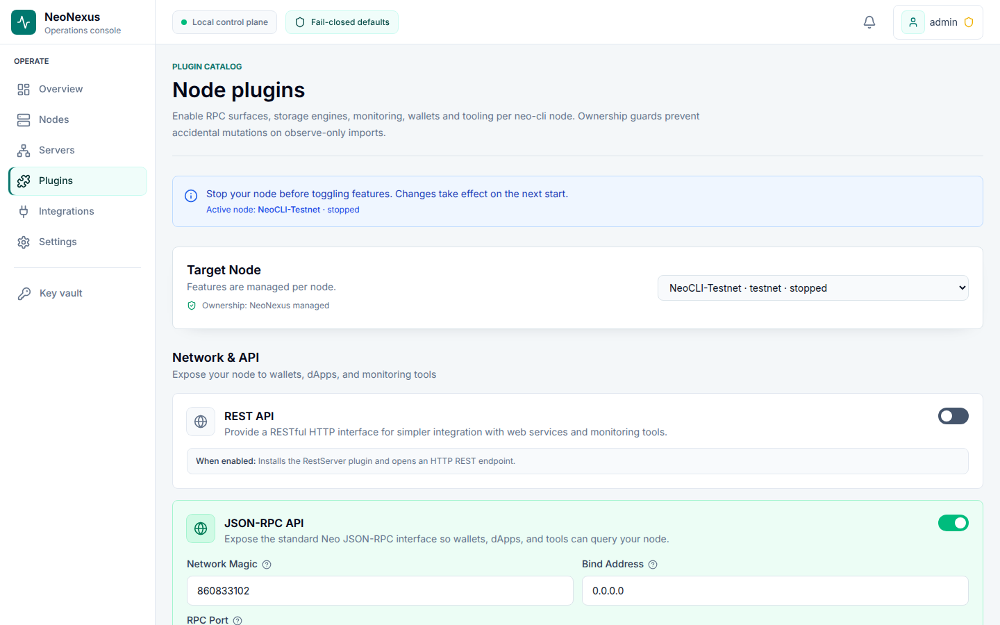
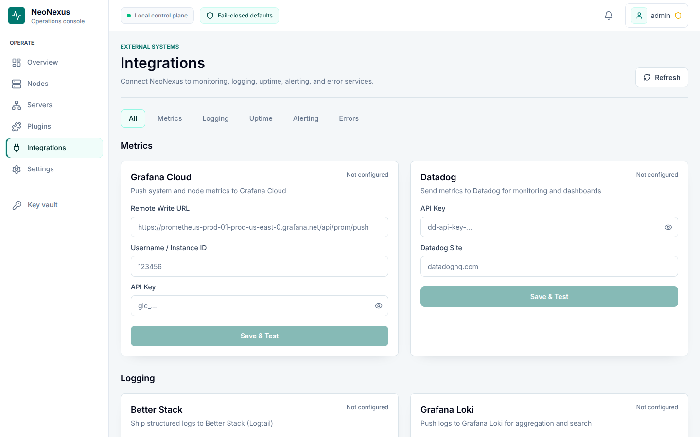
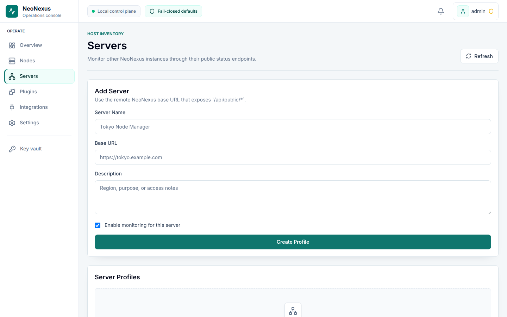
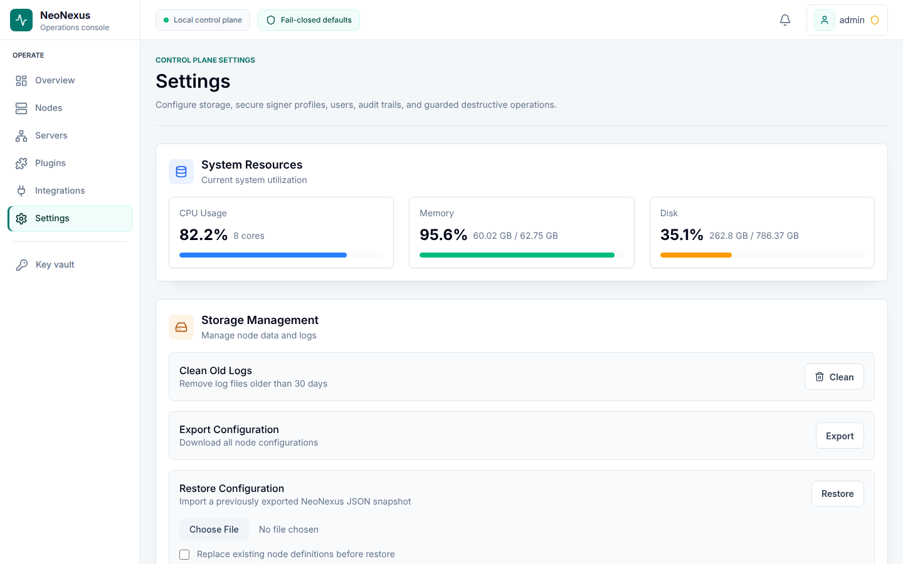
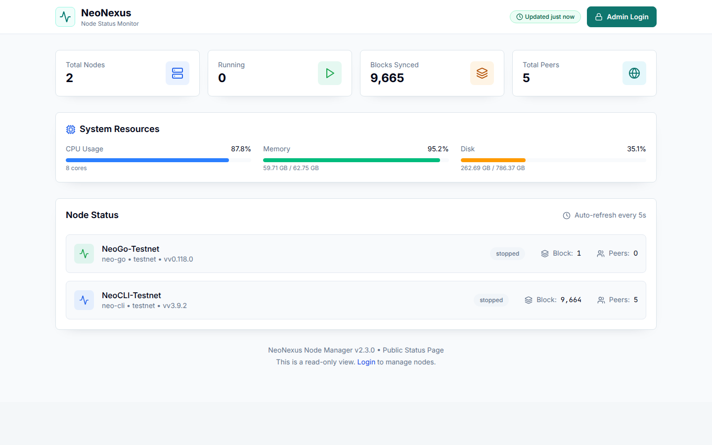
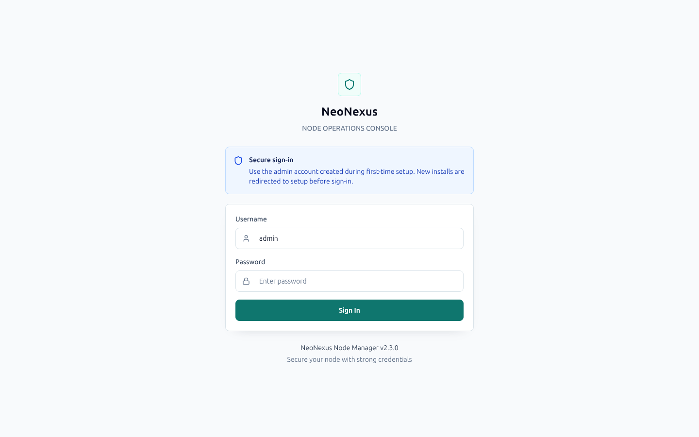
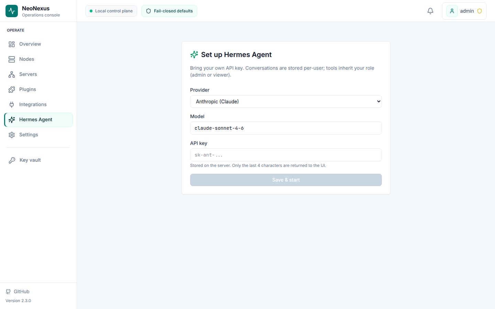
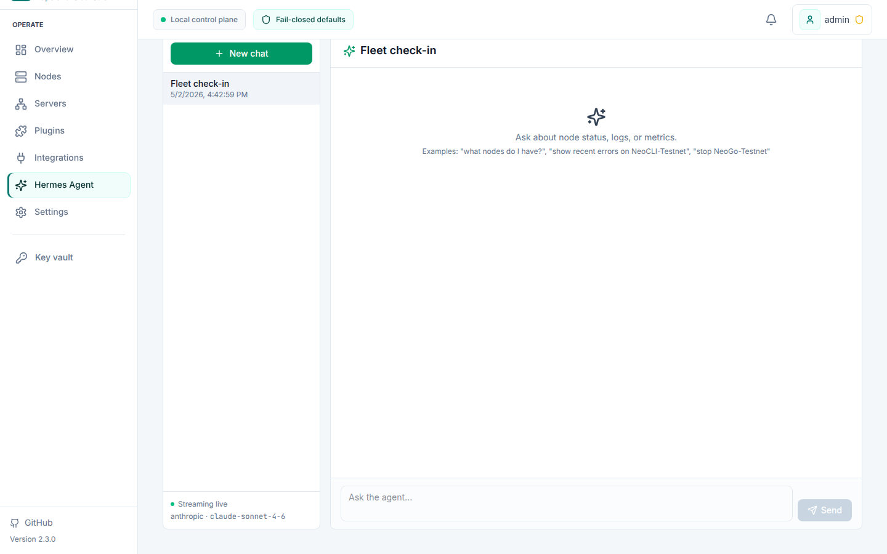

# NeoNexus Node Manager

> Self-hosted Neo N3 node management, simplified

[](https://github.com/r3e-network/neo-nexus)
[](LICENSE)
[](https://nodejs.org)
[](#)

NeoNexus is a **self-hosted node management platform** for Neo N3. Deploy, monitor, and manage [neo-cli](https://github.com/neo-project/neo-node) and [neo-go](https://github.com/nspcc-dev/neo-go) nodes from a single web dashboard.

## Screenshots

**Operations dashboard** — fleet health, node lifecycle, plugins, monitoring, and signer posture in one workspace.



**Node fleet** — search, filter, and operate every neo-cli / neo-go process you manage.



**Plugins** — toggle RPC, storage, and tooling plugins per node with ownership-aware safety guards.



**Integrations** — connect metrics, logging, uptime, alerting, and error services with private-target SSRF protection.



**Servers** — federate multiple NeoNexus instances through their public status endpoints.



**Settings** — storage management, secure-signer profiles, audit log, users, and guarded destructive operations.



**Public status page** at `/status` — read-only fleet view safe to expose externally.



**Sign-in** — bearer-token JWT, with WebSocket auth via the `neonexus.auth` subprotocol.



**Hermes Agent** — bring your own Anthropic / OpenAI / OpenAI-compatible key. The agent talks to your fleet via streaming tool-calls (start/stop/restart nodes, toggle plugins, fetch logs/metrics/network height) with role-gated permissions and DNS-rebind-protected outbound calls.




## Features

- **One-Click Deploy** — Deploy Neo nodes in minutes without CLI setup
- **Real-Time Monitoring** — Track block height, sync progress, peers, CPU, memory via WebSocket
- **Crash Recovery** — Automatic restart with exponential backoff when nodes crash
- **Plugin Management** — Install and configure neo-cli plugins through the UI
- **Role Orchestration** — Apply built-in or custom node identities such as RPC/API, State, Oracle, Consensus, Indexer, and Secure Signer Client
- **Data Context Switching** — Save isolated blockchain data contexts per node for one-click switching between roles, storage engines, sync strategies, checkpoints, and snapshots
- **Fast Sync Snapshots** — Register local, HTTPS, or catalog snapshot manifests, verify SHA-256, download packages, and bind checkpoints to isolated contexts
- **Private Network Planner** — Generate single-node, 4-node, or 7-node private Neo N3 networks with addresses, public keys, ports, seed lists, committee config, and plugin presets
- **Storage Engine Selection** — Choose LevelDB or RocksDB when creating nodes, applying roles, or planning private networks
- **Multi-Network** — Mainnet, testnet, and private networks with correct protocol configs
- **Multi-Server** — Monitor multiple NeoNexus instances from one control panel
- **Config Audit** — Detect stale configs, missing plugins, hardfork mismatches
- **Backup/Restore** — JSON export/import of all node configurations
- **Audit Logging** — Track all state-changing operations
- **Secure Signers** — TEE key protection via Intel SGX, AWS Nitro, or custom endpoints
- **SaaS Integrations** — Optional Grafana Cloud, Datadog, Better Stack, Sentry, Slack, Discord, Telegram, and more — just add a token
- **Hermes Agent** — Bring-your-own-key in-app AI agent (Anthropic, OpenAI, OpenAI-compatible) that operates the fleet on your behalf with role-gated tools and DNS-rebind-protected outbound calls — see the Hermes section below
- **Neo X support (preview)** — Manage `neox-go` (geth fork from `bane-labs/go-ethereum`) alongside Neo N3 nodes. Separate port range (8551 RPC / 30303 P2P), EVM JSON-RPC metrics (`eth_blockNumber`, `net_peerCount`, `eth_chainId`), mainnet (chain id 47763) and testnet (12227332). Linux-only binaries. Enable with `NEONEXUS_ENABLE_NEOX=true`.

## Quick Start

### Requirements

- **Node.js** 20+
- **npm** 9+
- **.NET 10+** (for neo-cli nodes)

### Installation

```bash
git clone https://github.com/r3e-network/neo-nexus.git
cd neo-nexus

npm install
npm run build
npm start
```

Open http://localhost:8080 and create the first admin account in the setup screen.

### Deploy Your First Node

1. Click **Create Node**
2. Select **Type** (neo-cli or neo-go), **Network** (mainnet/testnet/private), storage engine, and sync strategy
3. Optionally choose a built-in role preset such as RPC/API, State, Oracle, Consensus, Indexer, or Secure Signer Client
4. Click **Deploy** — the binary, plugin plan, config, storage context, and sync settings are prepared and ready to start
5. Use the node detail view to preview and apply role changes or switch isolated data contexts later

### Use Local neo-node Builds

To use plugins built from a local [neo-node](https://github.com/neo-project/neo-node) checkout:

```bash
cd ~/git/neo-node && git checkout v3.9.2
dotnet build neo-node.sln -c Release

# Start NeoNexus with local plugin path
NEO_PLUGIN_BUILD_DIR=~/git/neo-node/plugins npm start
```

## Architecture

```
                        Web Browser
                            |
                     HTTP / WebSocket
                            |
              +-------------+-------------+
              |     NeoNexus Server        |
              |  Express + SQLite + ws     |
              +--+-------+-------+--------+
                 |       |       |
           +-----+  +---+---+  ++--------+
           |     |  |       |  |         |
        neo-cli  neo-go   neo-cli     neo-go
        Node 1   Node 2   Node 3     Node N
```

**Backend:** TypeScript, Express, better-sqlite3, ws
**Frontend:** React, TanStack Query, Tailwind CSS, Vite
**Processes:** Managed via `child_process.spawn` with PTY support for neo-cli

## Supported Software

| Software | Versions | Networks |
|----------|----------|----------|
| neo-cli | v3.6.0 — v3.9.2 | Mainnet, Testnet, Private |
| neo-go | v0.104.0+ | Mainnet, Testnet, Private |

## Production Features

### Crash Recovery

Nodes that crash are automatically restarted with exponential backoff (2s, 4s, 8s... up to 30s). After 5 consecutive failures the watchdog gives up and alerts. Backoff resets after 5 minutes of stable running.

### Sync Progress

NeoNexus queries seed nodes to determine the network's current block height, then computes `syncProgress = localHeight / networkHeight` for each running node. Stalled nodes (no new blocks for 5 minutes) are flagged.

### Config Audit

`GET /api/nodes/:id/config-audit` compares the on-disk config against the expected generated config and reports:
- Missing or mismatched critical fields (network magic, committee, hardforks)
- Missing plugin DLLs and config files
- Port conflicts
- Binary availability

### Process Management

- **Graceful shutdown:** SIGTERM/SIGINT handlers stop all nodes before exit
- **Zombie detection:** On startup, reconciles DB state with actual running processes
- **PID tracking:** Writes `~/.neonexus/neonexus.pid` for process management
- **Resource limits:** Set per-node memory limits via `settings.resourceLimits.maxMemoryMB`

### Observability

- **Disk monitoring:** Tracks growth rate, alerts at 90%/95% usage, predicts days until full
- **Log retention:** Auto-prunes to 50K rows per node (configurable via `LOG_RETENTION_MAX_ROWS`)
- **Audit log:** All state-changing operations logged to `audit_log` table, queryable via API
- **WebSocket:** Real-time system metrics, node metrics, and log streaming

## Role Orchestration, Fast Sync, and Private Networks

NeoNexus can treat each node as a saved operational identity instead of a one-off collection of settings. Built-in roles cover common N3 responsibilities:

| Role | Purpose | Typical automation |
|------|---------|--------------------|
| RPC / API Node | Serve wallet, dApp, and monitoring traffic | Enables RPC, peer limits, LevelDB, fast sync |
| State Node | Track state roots and proof workflows | Enables StateService, RPC, RocksDB, fast sync |
| Oracle Node | Process off-chain data requests | Enables OracleService, RPC, fast sync |
| Consensus Node | Prepare validator nodes for dBFT participation | Enables DBFTPlugin, full sync, consensus warnings |
| Indexer Node | Index application logs and token transfers | Enables ApplicationLogs, TokensTracker, RPC, RocksDB |
| Secure Signer Client | Use external signing instead of local private keys | Enables SignClient and signer profile prerequisites |

Custom roles can store the same kinds of decisions: plugin desired state, node settings, storage engine, data-context policy, sync strategy, warnings, and prerequisites. Applying a role first builds a plan so operators can review plugin/config/storage/data-context changes before mutating a node.

Data contexts isolate blockchain data under the managed node directory. A context records its label, storage engine (`leveldb` or `rocksdb`), sync strategy (`full`, `light`, or `fast-sync`), optional checkpoint height/hash, and optional fast-sync snapshot id. Nodes must be stopped before activating a different context so on-disk data and generated config stay consistent.

Fast sync snapshots are registered as manifests. Sources can be local files, HTTPS URLs, or a catalog entry; NeoNexus verifies SHA-256, records verification metadata, and can download HTTPS packages into the managed downloads directory. Snapshot manifests are user-provided in this release, so production operators should publish and sign their own trusted snapshot catalog.

Private network planning supports Neo N3 single-node, 4-node, and 7-node templates. Plans generate network magic, per-node ports, seed lists, validator count, standby committee keys, addresses, storage engine choices, and neo-cli plugin presets. A plan can be previewed as a configuration snapshot and then applied to create or replace managed private-network nodes.

## Plugin Support (neo-cli)

Install and manage official neo-cli plugins through the UI:

| Plugin | Category | Description |
|--------|----------|-------------|
| LevelDBStore | Storage | Default storage backend |
| RocksDBStore | Storage | Alternative storage backend |
| RpcServer | API | JSON-RPC endpoint |
| RestServer | API | REST API endpoint |
| ApplicationLogs | Core | Transaction and execution logs |
| DBFTPlugin | Core | dBFT consensus |
| TokensTracker | API | NEP-11/NEP-17 token tracking |
| StateService | Core | State root service |
| OracleService | Core | Oracle data integration |
| SQLiteWallet | Tooling | Wallet storage |
| SignClient | Tooling | Remote signing via secure signer |
| StorageDumper | Tooling | Storage export |

## Secure Signers / TEE Key Protection

Neo-cli nodes can reference a secure signing endpoint instead of raw private-key material:

- **Modes:** Software, Intel SGX, AWS Nitro Enclave, Custom
- **Integration:** Auto-wires through the Neo `SignClient` plugin
- **Orchestration:** Generate deploy/unlock/status commands for local signer instances
- **Safety:** NeoNexus never stores WIF, plaintext private keys, or unlock passphrases

## API Reference

### Authentication

```bash
# Login
curl -X POST http://localhost:8080/api/auth/login \
  -H "Content-Type: application/json" \
  -d '{"username":"admin","password":"admin"}'

# Use token for authenticated requests
curl http://localhost:8080/api/nodes \
  -H "Authorization: Bearer YOUR_TOKEN"
```

### Key Endpoints

| Method | Path | Description |
|--------|------|-------------|
| GET | `/api/health` | Health check (public) |
| GET | `/api/nodes` | List all nodes |
| POST | `/api/nodes` | Create node |
| POST | `/api/nodes/:id/start` | Start node |
| POST | `/api/nodes/:id/stop` | Stop node |
| GET | `/api/nodes/:id/logs` | Get node logs |
| GET | `/api/nodes/:id/config-audit` | Audit config |
| GET | `/api/nodes/:id/data-contexts` | List isolated data contexts |
| POST | `/api/nodes/:id/data-contexts` | Create a data context |
| POST | `/api/nodes/:id/data-contexts/:contextId/activate` | Activate a data context |
| GET | `/api/nodes/:id/role-applications` | List role application history |
| GET | `/api/nodes/:id/plugins/available` | List available plugins |
| POST | `/api/nodes/:id/plugins` | Install plugin |
| GET | `/api/node-roles` | List built-in and custom roles |
| POST | `/api/node-roles` | Create custom role |
| POST | `/api/node-roles/:roleId/plan` | Preview role application |
| POST | `/api/node-roles/:roleId/apply` | Apply role to a node |
| GET | `/api/fast-sync/snapshots` | List fast-sync snapshot manifests |
| POST | `/api/fast-sync/snapshots` | Register snapshot manifest |
| POST | `/api/fast-sync/snapshots/:id/verify` | Verify snapshot checksum |
| POST | `/api/fast-sync/snapshots/:id/download` | Download HTTPS snapshot |
| GET | `/api/private-networks/plans` | List private network plans |
| POST | `/api/private-networks/plans` | Create private network plan |
| GET | `/api/private-networks/plans/:id/configuration-snapshot` | Preview generated config |
| POST | `/api/private-networks/plans/:id/apply` | Apply private network plan |
| GET | `/api/metrics/system` | System metrics |
| GET | `/api/metrics/network` | Network heights |
| GET | `/api/system/export` | Export configuration |
| POST | `/api/system/restore` | Restore configuration |
| GET | `/api/system/audit-log` | Query audit log |
| GET | `/api/servers` | List remote servers |
| GET | `/api/secure-signers` | List signer profiles |
| GET | `/api/agent/health` | Hermes feature-flag status |
| PUT | `/api/agent/settings` | Save provider/model/API key |
| POST | `/api/agent/conversations` | Start a new chat |
| POST | `/api/agent/conversations/:id/messages` | Non-streaming send (WS preferred) |

### WebSocket

Connect to `ws://localhost:8080/ws` with the `neonexus.auth` subprotocol and JWT token as the second protocol value:

```js
const ws = new WebSocket("ws://localhost:8080/ws", ["neonexus.auth", "YOUR_TOKEN"]);
```

- `system` — CPU, memory, disk metrics (every 5s)
- `metrics` — Per-node block height, peers, sync progress
- `log` — Live node log entries
- `status` — Node status changes
- `agent.delta` / `agent.tool_use` / `agent.tool_result` / `agent.complete` — Hermes streaming events. Send `{"type":"agent.send","conversationId":"…","text":"…"}` and `{"type":"agent.cancel","conversationId":"…"}` over the same socket.

## Environment Variables

| Variable | Default | Description |
|----------|---------|-------------|
| `PORT` | `8080` | Server port |
| `HOST` | `0.0.0.0` | Bind address |
| `NEONEXUS_DATA_DIR` | `~/.neonexus` | Storage root for database, nodes, downloads, plugins, logs, and PID file |
| `DATA_DIR` | — | Backward-compatible alias for `NEONEXUS_DATA_DIR`; ignored when `NEONEXUS_DATA_DIR` is set |
| `JWT_SECRET` | random (dev) | JWT signing key (required in production) |
| `JWT_EXPIRES_IN` | `24h` | Token expiration |
| `CORS_ORIGIN` | — | Allowed CORS origins (comma-separated) |
| `HTTPS_ENABLED` | `false` | Enable HTTPS |
| `HTTPS_KEY_PATH` | — | TLS key file |
| `HTTPS_CERT_PATH` | — | TLS cert file |
| `LOG_RETENTION_MAX_ROWS` | `50000` | Max log rows per node |
| `NEO_PLUGIN_BUILD_DIR` | — | Local neo-node plugins build directory |
| `NEONEXUS_ALLOW_PRIVATE_REMOTE_SERVERS` | `false` | Allow remote NeoNexus server profiles to target private/local networks |
| `NEONEXUS_ALLOW_PRIVATE_SIGNER_ENDPOINTS` | `false` | Allow HTTP secure-signer endpoints on private/local networks |
| `NEONEXUS_ALLOW_PRIVATE_INTEGRATION_TARGETS` | `false` | Allow integration webhooks/metrics/logging endpoints on private/local networks |
| `NEONEXUS_ENABLE_HERMES_AGENT` | `false` | Turn on the Hermes in-app AI agent. Each user supplies their own API key via Settings; tools inherit the user's role (admin/viewer). |
| `NEONEXUS_ENABLE_NEOX` | `false` | Reveal Neo X (chain `x`, type `neox-go`, networks `neox-mainnet` / `neox-testnet`) alongside Neo N3 in the create-node UI and downloader. |

## Development

```bash
# Development mode (hot reload)
npm run dev

# Run tests
npm test

# Type checking
npm run typecheck

# Production build
npm run build
```

## License

MIT

---

<p align="center">
  Built for the Neo community
</p>
