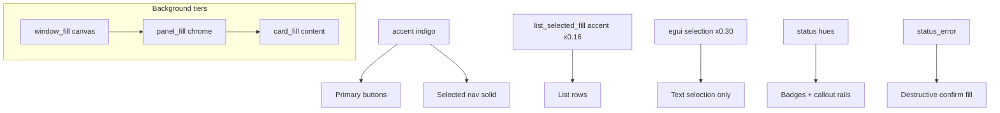
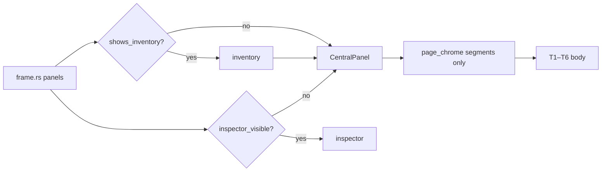
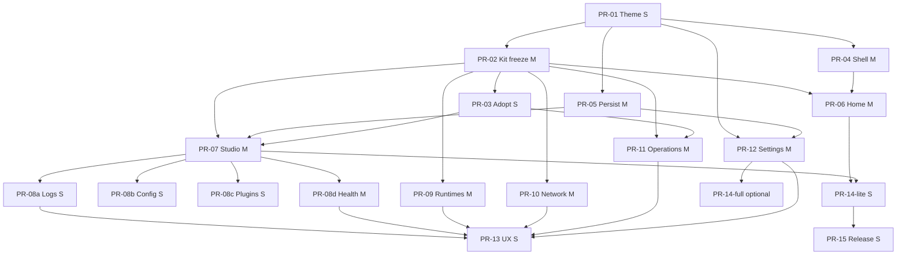

# NeoNexus UI System Redesign — v3.1 Visual System

| Field | Value |
|-------|--------|
| **Document** | UI System Redesign (v3.1) |
| **Product** | NeoNexus 3.0.0 → 3.1.x |
| **Author** | _TBD_ |
| **Date** | 2026-07-15 |
| **Status** | Shipped in **3.1.0** (PR-01–15 + PR-14-full geometry gate) |
| **Stack** | Pure Rust · eframe/egui 0.33 · SQLite · dual GUI+CLI |
| **Repo** | `/Users/jinghuiliao/git/r3e/neo-nexus` |
| **Supersedes** | Partial IA + widget kit shipped in 3.0.0 (`docs/ui-v3-baseline.md`) |

---

## Overview

NeoNexus is a pure Rust native desktop workbench for Neo N3 node operations (neo-cli / neo-go / neo-rs). Version **3.0.0** already shipped a six-primary information architecture, a partial shared widget kit, theme tokens, god-state split (`session` / `fleet` / `operations_ui` / `sections` / `async_bus`), and headless UI contract tests. Operators still experience uneven density, inconsistent page chrome, one-off list/card patterns, and surfaces that feel assembled rather than designed end-to-end.

**v3.1** completes the visual and interaction system **without** leaving native egui: one type/spacing/elevation contract, shared page templates, a fully catalogued component library with explicit states, operator-grade interaction patterns (loading / empty / error / confirm / toast), surface-by-surface specs with acceptance criteria, and an incremental PR plan that freezes domain services, CLI, and SQLite schema (UI prefs only where needed). Tone remains a calm macOS-density ops workbench (Dappnode/Stereum-class clarity)—not neon or cyber.

**Minimum shippable cut line (v3.1.0):** PR-01 (tokens, Comfortable-only) → PR-02 (kit API freeze including `busy_inline`) → PR-03 (kit adoption) → PR-04 (shell, density-invariant chrome) → PR-05 (tab + density persist) → PR-06–07 (Home + Nodes Studio) → PR-14-lite (contracts) → PR-15. Parallel surfaces PR-08a–d, PR-09–12 complete the full polish track; Compact **list-row** densification stays behind a geometry proof gate (PR-14 full).

---

## Background & Motivation

### Current state (grounded in code)

| Layer | Location | What exists today |
|-------|----------|-------------------|
| Shell chrome | `src/app/frame.rs`, `src/app/views/shell/*` | Fixed panels: header **60pt**, status **28pt**, sidebar **212pt**, inventory 248 (200–340), inspector 320 (280–420), central workspace with 22×18 margins |
| Theme | `src/app/theme/{palette,tokens,style,icons}.rs` | Light/dark indigo accent; 3-tier surfaces (`window_fill` < `panel_fill` < `card_fill`); type scale 11/12/13/14/17/24; 4pt spacing XS–XL (`XL` defined but not re-exported from `theme.rs`); Phosphor Regular icons |
| Views (14 enum / 6 primary) | `src/app/view.rs`, `src/app/views.rs` | Primaries: Home, Nodes, Runtimes, Network, Operations, Settings; legacy views normalize via `normalize_navigation_for_v3` + `View::primary_nav` |
| Widgets | `src/app/widgets/*` | badges, callout, controls, filter_bar, form, layout, node_row, nodes, page_header (dead_code, unused), plugins, segmented, toolbar |
| State | `src/app/state/*` | `SessionUi`, `FleetUi`, `OperationsUi`, `WorkspaceSections`, `AsyncProbeBus`, `ToastStack` |
| Section persist | `workspace_section_flow.rs`, `lifecycle/startup/workspace_prefs.rs` | Keys `workspace.section.{operations,settings,runtimes,snapshots,monitor,federation,roles}` + shadow fields; **no** nodes tab key yet |
| Constraints | `source_quality.rs`, `native_ui_audit` | Max ~200 lines per Rust source file; **no** `ScrollArea` / `TableBuilder` / WebView / Tauri; fixed-panel + pagination model |
| Contract tests | `tests/ui_*.rs` | Geometry, typography scale, empty states, error coloring, keyboard Tab reach, dark-tier separation, optional visual truth |

### Pain points

1. **Incomplete adoption of the kit** — `page_header` is dead code; multi-section pages hand-roll segmented controls.
2. **No density preference** — Comfortable values are hard-coded in `style.rs`; Compact is not available (and must not ship unproven row heights).
3. **Uneven list patterns** — `node_row` (accent×0.18, r=10) vs journal (accent×0.14, r=8, slot 52) vs Grid tables.
4. **Weak loading UX** — `async_bus` status chips only; panels rarely show in-flight placeholders.
5. **Confirmation ad-hoc** — Delete uses danger callout + accent `primary_button` Confirm (not danger-filled).
6. **Elevation inconsistency** — Cards shadow; chrome flat; nested `form_group` ad hoc.
7. **God-state remainder** — Many filter/paging fields still on `NeoNexusApp`; out of scope unless a surface PR needs a field.

### Why now

3.0.0 locked IA and foundations. v3.1 is the polish release: one product feel end-to-end, preserve headless contracts, ship mergeable PRs that never touch domain/CLI.

---

## Goals & Non-Goals

### Goals

1. **Visual system** — Type, spacing, color roles, elevation, density (Comfortable shipped; Compact control metrics only until geometry proof), iconography, light/dark.
2. **Layout system** — Shell regions + templates T1–T6 inside fixed panels.
3. **Component library** — Catalog + frozen P0/P1 APIs (`list_row`, `confirm_bar`, `page_chrome`, `busy_inline`).
4. **Interaction patterns** — Selection, keyboard, toasts, empty/error/loading, danger confirm, primary vs secondary.
5. **IA refinements** — Keep six primaries; in-page flow only.
6. **Surface specs** — Wireframes + **acceptance** per surface (empty/error/loading, domain freezes).
7. **Accessibility & operator UX** — Keyboard-first, WCAG-ish contrast, discoverability.
8. **Implementation mapping** — Existing modules; no domain/CLI breakage.
9. **PR plan** — Ordered, sized, with minimum shippable cut line.
10. **Key decisions** — Closed product choices (no blocking open questions).

### Non-Goals

- WebView / Tauri / React migration.
- Domain services, CLI, or SQLite **domain** schema changes (UI prefs only: density, section keys).
- Full god-state extraction.
- `ScrollArea` / `TableBuilder` / virtualized tables.
- Compact **list/inventory row height** changes without a geometry proof PR.
- Focus rings on `Sense::click` list rows (egui keyboard focus on buttons remains; custom row focus is out of v3.1).
- Command palette.
- Branding redesign.

---

## Proposed Design

### 1. Visual system

#### 1.1 Design principles

| Principle | Application |
|-----------|-------------|
| **Calm workbench** | Near-neutral surfaces, single indigo accent, soft elevation |
| **Three-tier depth** | Canvas → chrome → cards (`ui_visual_contract.rs`) |
| **One rhythm** | 4pt spacing + type scale from `tokens.rs`; **no raw `.size(n)` / gap literals in `views/`** |
| **Operator priority** | Status, next action, selection outrank decoration |
| **Fixed panels** | Pagination + reserved row slots; chrome sizes density-invariant |

#### 1.2 Color roles

Map to `src/app/theme/palette.rs` + accessors in `theme.rs`. RGB frozen unless contrast fails tests.

| Role | Light | Dark | Usage |
|------|-------|------|-------|
| `accent` / `accent_hover` / `on_accent` | 88,86,214 / 73,71,196 / white | 100,97,235 / 86,83,220 / white | Primary actions, selected **nav**, list selection **stroke** |
| `text` / `muted_text` | 29,29,31 / 117,117,123 | 243,243,245 / 162,162,168 | Body / secondary |
| `window_fill` | 236,236,240 | 20,20,23 | Canvas |
| `panel_fill` | 244,244,248 | 38,38,44 | Shell chrome |
| `card_fill` | 255,255,255 | 56,56,63 | Cards, list rows |
| `field_fill` / `faint_fill` | white / 232,232,237 | 50,50,57 / 52,52,59 | Inputs / hover wash |
| `border` | 220,220,226 | 78,78,88 | Hairlines |
| `status_running` → success | 40,167,90 | 48,209,88 | Running, pass |
| `status_starting` → warning | 200,110,0 | 255,214,70 | Starting, warn |
| `status_stopped` | 142,142,147 | 152,152,157 | Offline neutral |
| `status_error` → danger / destructive | 213,60,55 | 255,105,97 | Errors, **confirm destructive fill** |
| `info` | 10,122,158 | 90,200,250 | Info, network chips |

**Selection tokens (separated — do not conflate):**

| Token | Value | Use |
|-------|-------|-----|
| `list_selected_fill` | `accent.gamma_multiply(0.16)` | Inventory, journal, readiness, federation rows |
| `list_selected_stroke` | 1.0pt `accent` | Selected list/nav rows |
| `list_hover_fill` | `faint_fill` | Unselected row hover |
| `list_hover_stroke` | 1.0pt `accent` | Unselected row hover |
| `nav_selected_fill` | solid `accent` | Sidebar selected item |
| `egui_text_selection_bg` | `accent.gamma_multiply(0.30)` | **Only** `style.visuals.selection` in `style.rs` (text ranges), **not** list rows |

**Other:**

| Role | Mapping | Notes |
|------|---------|-------|
| `destructive` | alias `status_error` | `confirm_bar` primary fill + white text |
| `toast_*` | `ToastKind` → theme colors | Status-bar chips |
| `focus_ring` | **Out of scope v3.1** for `Sense::click` rows | egui native focus on `Button`/`TextEdit` only |



#### 1.3 Type scale

Locked in `tokens.rs` (enforced by `tests/ui_typography.rs`):

| Token | Size | Constructor | Use |
|-------|------|-------------|-----|
| Caption | 11pt | `label_caption` (uppercase, muted) | Metric titles, form labels |
| Column header | 12pt | `column_header` | Grid headers |
| Body | 13pt | `body` / `muted_body` | Default copy, nav, list |
| Section title | 14pt | `section_title` | Card/panel titles |
| Page title | 17pt | `page_title` | **Shell header only** (+ empty-state titles, brand) |
| Metric value | 24pt | `metric_value` | KPI figures, empty glyph |

**Typography rules:**

1. **`views/`** must not call `.size(n)` with literals; use token constructors only.
2. **Kit modules** (`widgets/`, `theme/`) may use shared `SIZE_*` constants from `tokens.rs` (or constructors). Badges today use `.size(11.0)` on-scale — migrate to `SIZE_CAPTION` / a `badge_label()` helper in the kit PR; not a views concern.
3. Icon glyphs share **body** size except brand empty-state (metric 24) and brand mark.

#### 1.4 Spacing scale

| Token | Value | Typical use |
|-------|-------|-------------|
| `XS` | 4 | Tight gaps inside rows |
| `SM` | 8 | Default stack gap; **layout `gap` replacement** |
| `MD` | 12 | Between major blocks; after page chrome |
| `LG` | 16 | Form section breaks |
| `XL` | 20 | Rare breathing room |

**Export:** Re-export `XL` from `theme.rs` alongside `XS, SM, MD, LG` (today XL is `#[allow(dead_code)]` in tokens only).

**Literal gap migration (PR-01):** replace `let gap = 8.0` in **all** layout helpers:

- `views/overview/layout.rs`
- `views/nodes/layout.rs`
- `views/logs/layout.rs`
- `views/plugins/layout.rs`
- `views/alerts/layout.rs`
- `views/wallets/layout.rs`

Scope for v3.1: these layout helpers only (not every numeric literal in the app). Rule for new code: no gap literals in `views/`.

#### 1.5 Elevation & radius

| Level | Fill | Stroke | Shadow | Radius | Use |
|-------|------|--------|--------|--------|-----|
| E0 Canvas | `window_fill` | — | none | 0 | Central base |
| E1 Chrome | `panel_fill` | hairline | none | 0 | `chrome_frame` |
| E2 Card | `card_fill` | hairline | `card_shadow()` | **12** | `card_frame`, metric tiles, panels |
| E3 Control / list row | `card_fill` / selection | hairline or accent | none | **10** list rows; **8** buttons/segment | Buttons, segmented, list rows |
| E4 Badge | status α36 | none | none | **6** | Status/severity pills |

Do not nest E2 inside E2 without `form_group` inset.

#### 1.6 Density modes

| Mode | Status in v3.1 |
|------|----------------|
| **Comfortable** | **Default.** Matches current `style.rs` and `node_row` heights. Fully applied. |
| **Compact** | **Preference is persisted and must produce visible control densification** when selected (see below). **List/inventory/journal row heights stay Comfortable** until a geometry proof PR (PR-14-full). |

##### Compact is not a no-op (required wiring)

Selecting Compact in Settings → Storage **must** change operator-visible control density in the same release track that exposes the control:

| Applies in Compact (required) | Does **not** change in Compact (v3.1) |
|-------------------------------|--------------------------------------|
| `interact_size.y` → 24 | List/inventory/journal row heights (44/56/52) |
| Button padding → 10×6 | Chrome header/status/sidebar exact sizes |
| `item_spacing` → 8×6 | Filter/field heights stay 28 |
| Sidebar **nav row height** → 28 | Card radius, type scale |

**Owning PR:** **PR-12 must** load `session.density` into `configure_style` every frame (via existing `frame.rs` / `configure_style(context, theme)` extended to take density, or read active density from session inside style config). Shipping a Compact radio that only persists a key with zero layout/style effect is **forbidden**.

**PR-01** defines `DensityMetrics` for both modes and unit-tests values. **PR-04** keeps chrome sizes invariant and does **not** need to apply Compact early. **PR-05** persists the key. **PR-12** is the first PR that both **shows the Storage control** and **applies Compact control metrics** — same PR, required, not optional.

##### Density metrics table

| Parameter | Comfortable (ship) | Compact (scaffold; apply carefully) |
|-----------|-------------------|-------------------------------------|
| `interact_size.y` | 28 | 24 (style only; after unit tests) |
| Button padding | 14×8 | 10×6 |
| `item_spacing` | 10×8 | 8×6 |
| Nav row height | 34 | **28** (applied with Compact in PR-12; chrome **panel** widths/heights never change) |
| Filter bar height | 28 | 28 (v3.1: **no densify** — keeps type + hit target) |
| Form field height (`field_text`) | 28 | 28 (same) |
| Pagination controls | secondary min 76×30 | min height may follow `interact_y` via style; label padding follows button pad |
| Inventory / list row heights | **44 compact-flag / 56 full** (`node_row` today) | **Same as Comfortable** until proof PR |
| Journal reserved slot | 52 | **Same** until proof PR |
| Readiness / action-queue rows | **Content-height** (no fixed slot today) | Same — content-height |
| Chrome header / status / sidebar | **60 / 28 / 212** | **Identical** (density-invariant) |

##### Density layout math (worked example)

Design window content column (Summary with inventory + inspector, approx):

- Screen: 1280×820
- Minus header 60 + status 28 → workbench height **732**
- Inventory panel: margins ~14×2 vertical chrome already in panel; list region roughly **~620–680** usable after filter + mini-stats + pagination
- `NODE_PAGE_SIZE = 7`, row height 44 + gap XS(4) ≈ 48 → 7×48 = **336** for rows + pagination bar ~36 → fits with margin
- If Compact inventory were **36** + 4 gap = 40 → 7×40 = 280 (fits) **but** two-line anatomy (name + badge row, inner_margin 10×8, body 13) **clips below ~40–42** without redesigning to single-line

**Conclusion (v3.1.0 ship):** Comfortable keeps two-line 44/56.  
**Post-ship geometry proof (landed):** Compact switches to **single-line** anatomy at **40pt** (inventory + fleet). Journal slots remain 52. Chrome stays density-invariant.

##### Compact inventory ASCII (shipped after geometry proof)

```
Comfortable two-line (heights 44/56):
┌────────────────────────────────────┐
│ ●  node-name            [Running]  │
│    [neo-go] [testnet]        :10332│
└────────────────────────────────────┘

Compact single-line (height 40):
┌────────────────────────────────────┐
│ ● node-name [neo-go] [test] :10332 │
│                            [Running]│
└────────────────────────────────────┘
```

##### Implementation sketch

```rust
// theme/density.rs
pub(in crate::app) enum UiDensity {
    Comfortable,
    Compact,
}

pub(in crate::app) struct DensityMetrics {
    pub interact_y: f32,
    pub button_pad: egui::Vec2,
    pub nav_row_h: f32,
    pub item_spacing: egui::Vec2,
    /// Always 44.0 / 56.0 in v3.1 regardless of UiDensity (proof-gated later).
    pub list_row_compact_h: f32,
    pub list_row_full_h: f32,
    pub filter_field_h: f32, // 28.0 both modes v3.1
}

impl UiDensity {
    pub fn metrics(self) -> DensityMetrics { /* Comfortable values; Compact control pads only */ }
    pub fn persist_key(self) -> &'static str {
        match self {
            Self::Comfortable => "comfortable",
            Self::Compact => "compact",
        }
    }
}
```

**Persistence:** like theme — key **`appearance.ui_density`** (values `comfortable` \| `compact`), constant `SETTING_APPEARANCE_UI_DENSITY` next to `SETTING_APPEARANCE_DARK_MODE` in `repository/settings_keys.rs`; load/save in `repository/policies/appearance.rs` mirroring `load_app_dark_mode` / `save_app_dark_mode`. Settings → Storage control in **PR-12** (must apply metrics, not persist-only). Default missing key → Comfortable.

#### 1.7 Iconography

- Phosphor Regular via `egui-phosphor` (`theme/icons.rs`).
- `view_icon_glyph`, `empty_glyph`, `brand_glyph`.
- Icons accompany text in sidebar; no icon-only destructive/lifecycle actions in v3.1.

#### 1.8 Light / dark contracts

- `Theme` + `ACTIVE_THEME` atomic; toggle sidebar + `⌘D`.
- Dark tiers: `MIN_TIER_GAP = 10` (`ui_visual_contract.rs`).
- Status hues brighter in dark.

---

### 2. Layout system

#### 2.1 Shell chrome regions

```
┌──────────────────────────────────────────────────────────────────────────┐
│ HEADER 60pt  title + subtitle | menu | New/Reload (+ Start/Stop/Restart) │
├──────────┬─────────────┬───────────────────────────────────┬─────────────┤
│ SIDEBAR  │ INVENTORY   │ CENTRAL WORKSPACE                 │ INSPECTOR   │
│ 212pt    │ 248 default │ margin 22×18 · page_chrome        │ 320 default │
│ fixed    │ 200–340     │ (no second page_title)            │ toggleable  │
├──────────┴─────────────┴───────────────────────────────────┴─────────────┤
│ STATUS 28pt  fleet chips | pressure | pending async | toast strip (≤2)   │
└──────────────────────────────────────────────────────────────────────────┘
Design window: 1280×820 — chrome sizes density-invariant
```

| Region | Visibility | Content rules |
|--------|------------|---------------|
| Sidebar | always | Brand, 6 primaries, theme + inspector toggles |
| Inventory | `View::shows_inventory()` | Filter, mini-stats, paged rows |
| Inspector | `session.inspector_visible` | Node + runtime facts |
| Header | always | Global title/subtitle for selected view. **Start/Stop/Restart** only when `primary_nav` ∈ {Home, Nodes, Operations}. **New Node** and **Reload** remain global on all primaries (`header/actions.rs`). |
| Status | always | Aggregates + ≤2 toast chips |

#### 2.2 Page templates

##### T1 — Triage dashboard (Home)

Metrics → resource → callout → selection | next actions / fleet. Fractions from `overview/layout.rs` (~38% left).

##### T2 — List + detail

Metrics optional → **page_chrome (segments/filters only)** → paged list → detail card.

##### T3 — Two-pane form / studio

page_chrome tabs → definition ~54–62% | summary. `nodes/layout.rs`, `runtimes/install.rs`.

##### T4 — Log viewer

Context ~34% | output remainder. `logs/layout.rs`.

##### T5 — Policy / settings form

page_chrome sections → form_groups → toolbar Save.

##### T6 — Hub shell (Network)

page_chrome segments → child T2/T3/T5.

#### 2.3 Responsive behavior

Fractional panes from central `available`; inventory/inspector hide widens center. No ScrollArea. Empty fleet → full-workspace empty_state on Home.



---

### 3. Component library

#### 3.1 Inventory (existing)

| Component | Module | Notes |
|-----------|--------|-------|
| Primary / secondary buttons | `controls.rs` | Min 100×30 / 76×30, r=8 |
| Toolbar | `toolbar.rs` | `ToolbarAction` primary/secondary/enabled/hint |
| Segmented control | `segmented.rs` | Pill, equal columns, selected = accent fill + `on_accent` strong body, unselected transparent, r outer 8 / inner 6, min height 28 — **source of truth; no visual delta required in v3.1** |
| Page header (legacy) | `page_header.rs` | **Superseded by `page_chrome`**; migrate callers to segments-only default |
| Filter bar / chip / chip_pill | `filter_bar.rs`, `controls.rs` | Filter height 28 |
| Pagination bar | `controls.rs` | |
| Status / severity / text badge | `badges.rs` | Kit-internal SIZE_CAPTION |
| Status dot | `badges.rs` | 8pt |
| Callout | `callout.rs` | Info/Success/Warning/Danger rail |
| Card / panel / metric / mini_stat / empty | `layout.rs` | E2 |
| Node row | `node_row.rs` | **PR-02 must** refactor to wrap `list_row_frame` (×0.16 matrix); inventory/fleet use this path |
| Fact / fact_error | `nodes.rs` | |
| Form field_text / field_combo / form_group | `form.rs` | Field height 28 |
| Grid header | `layout.rs` | |
| Toast strip | `state/toasts.rs` | |
| Nav item | `shell/sidebar.rs` | Solid accent when selected |
| Status chip | `shell/status.rs` | |

#### 3.2 States matrix

| State | Visual | Notes |
|-------|--------|-------|
| Default | card + hairline | |
| Hover (list) | `list_hover_fill` + `list_hover_stroke` | Pointing hand |
| Selected (list) | `list_selected_fill` + `list_selected_stroke` | |
| Selected (nav) | solid accent + on_accent | |
| Active / pressed (button) | accent fill (egui active) | |
| Disabled | egui disabled dimming; **size preserved** | Primary disabled: same min_size, reduced alpha via `add_enabled` |
| Error (field) | v3.1: optional — border danger + muted danger caption when validation string present | Prefer callout above form if multi-field |
| Loading | `busy_inline` / `loading_callout` | Disable duplicate primary submit |

**Segmented:** see `segmented.rs` — selected accent; unselected transparent; index clamped; no separate pressed chrome beyond egui.

#### 3.3 Do / Don't

| Do | Don't |
|----|-------|
| One `primary_button` per action group | Multiple accent buttons in one toolbar |
| `confirm_bar` for destructive | Immediate delete; accent-filled Confirm Delete |
| `empty_state_with_action` with real CTA | Blank empty panels |
| `theme::*` / tokens | Hard-coded RGB / off-scale sizes in views |
| `pagination_bar` + constants | ScrollArea |
| `page_chrome` with `title: None` on primaries | Second `page_title` under shell header |
| Files ≤200 lines | God files |

#### 3.4 New / extended components (v3.1)

| Component | Priority | Notes |
|-----------|----------|-------|
| **`page_chrome`** | **P0** | Segments/filters chrome; **title default None** |
| **`list_row_frame`** | **P0** | Shared selection geometry matrix; **`node_row` migrates in PR-02** |
| **`confirm_bar`** | **P0** | Danger-filled confirm |
| **`busy_inline` / loading_callout** | **P1 → ship in PR-02** | Surfaces adopt in their PRs |
| **`port_badge`** | **P2 new** | Thin wrapper on `text_badge` with labels RPC/P2P/WS — **not** already present |
| Density helpers | P1 | Via `DensityMetrics` |

##### Frozen list_row visual matrix

| Property | Value |
|----------|-------|
| `selected_fill` | `accent.gamma_multiply(0.16)` |
| `selected_stroke` | 1.0pt accent |
| `unselected_fill` | `card_surface()` |
| `unselected_stroke` | hairline |
| `hover_fill` (unselected) | `faint_fill` |
| `hover_stroke` (unselected) | 1.0pt accent |
| `corner_radius` | **10** |
| `inner_margin` | symmetric(10, 8) Comfortable |
| Heights | **Caller passes explicitly when fixed slots are used**: inventory compact **44**, full **56**, journal empty-slot **52** (matches `event_journal/list.rs`). **Readiness and action-queue rows: content-height** — do **not** pass a fixed 48pt height (current `readiness/checks.rs` is content-sized with `inner_margin` 10×6; no reserved empty slots today). Optional `min_height` only if a future paging pad is introduced. Kit does **not** invent density-scaled heights in v3.1. |
| Empty page padding slots | Only for lists that already pad (inventory 48-space placeholder, journal 52). Readiness/action-queue: **N/A** (no empty-slot padding today). |

All adopters pass height from page/`constants.rs` — no silent default that drifts.

#### 3.5 page_chrome adoption contract (single rule)

| Layer | Renders title? | Renders subtitle? | Renders segments/filters? |
|-------|----------------|-------------------|---------------------------|
| **Shell header** | Always `view.title()` | Always `view.subtitle()` | No |
| **Workspace `page_chrome`** | **`title: None` for all six primaries and their tabs** | **None** (shell owns copy) | Yes — segmented and/or trailing filters |
| Nested exception | Only if a future surface has no shell context (none in v3.1) | — | — |

**Before (Nodes today):**

```
[SHELL] Nodes / Define, configure, and operate…
[WORK]  [ Studio | Config | Logs | Plugins | Health ]   ← bare segmented_control
```

**After:**

```
[SHELL] Nodes / Define, configure, and operate…
[WORK]  page_chrome { title: None, segments: Studio…Health }  ← same visual, one API
[WORK]  <tab body>
```

**Before (Operations):** metrics then bare segmented.  
**After:** metrics then `page_chrome { title: None, segments: … }`.

Do **not** use legacy `page_header` title path on primaries (it always drew `page_title`).

---

### 4. Interaction patterns

#### 4.1 Selection

- Fleet: `fleet.selected_node` via `select_fleet_node`.
- List rows: click; `list_selected_*` chrome.
- Keyboard: Alt+↑/↓, PgUp/PgDn, Home/End.
- No silent clear on tab change.

#### 4.2 Keyboard

| Shortcut | Action |
|----------|--------|
| ⌘1–⌘6 | Primary views |
| ⌘[ / ⌘] | Prev / next primary |
| ⌘N | New node (global) |
| ⌘R / F5 | Reload (global) |
| ⌘Enter | Toggle start/stop |
| ⌘⇧Enter | Restart |
| ⌘D | Theme |
| Tab | Focus cycle (`ui_keyboard.rs`) |
| Alt+arrows / page / home / end | Inventory |

Text fields swallow shortcuts via `wants_keyboard_input`. Custom `Sense::click` rows: no focus ring v3.1.

#### 4.3 Loading

| Signal | Status bar | In-workspace |
|--------|------------|--------------|
| `async_bus.rpc_health_pending` | RPC chip | Nodes Health / inspector: `busy_inline("Checking RPC…")` when pending for selection |
| `remote_federation_pending` | Fed chip | Network Federation: busy when probing selected |
| `alert_delivery_pending` | Alerts chip | Settings Alerts: busy when deliveries in flight |
| Install/download | notice/toast | Runtime Install: disable Install primary + `loading_callout` when notice indicates work |
| Metrics 2s refresh | — | Silent |

#### 4.4 Empty / error

Unchanged patterns: `empty_state` / `empty_state_with_action`; danger text + sticky toast on faults (`ui_error_states.rs`).

#### 4.5 Confirmation

**`confirm_bar`** (destructive only):

1. Danger callout (title + consequence body).
2. Primary: **danger-filled** button (`status_error` fill, white strong label) — e.g. "Confirm Delete"; supports **disabled** when preconditions fail.
3. Secondary: Cancel (bordered).
4. Spacing: owns `MD` above block, `SM` between callout and buttons.
5. State in existing pending fields (`fleet.pending_delete_node`).

Non-destructive confirms (if any) use normal accent primary — not `confirm_bar`.

#### 4.6 Primary vs secondary

| Context | Primary | Secondary |
|---------|---------|-----------|
| Header | Start when startable; else none accent among lifecycle | Stop, Restart; **New Node** is primary create; **Reload** secondary |
| Forms | Save / Install / Create | Reset, Cancel |
| Confirm destructive | Danger Confirm | Cancel |
| Detail deep links | One accent CTA | Tools secondary |

#### 4.7 Toasts

`session.notice` → `ToastStack`; ≤2 chips; TTL 6s; errors sticky. No floating corner toasts.

---

### 5. Information architecture refinements

**Keep six primaries.** Sidebar `NAV_GROUPS` unchanged (Workspace / Nodes / Network / System).

| # | Primary | In-page |
|---|---------|---------|
| 1 | Home | T1 |
| 2 | Nodes | Studio / Config / Logs / Plugins / Health |
| 3 | Runtimes | Install / Catalog / Installed / Applied / Fast Sync |
| 4 | Network | Federation / Private Net / Wallets |
| 5 | Operations | Readiness / Action Queue / Ports / Safety / Journal |
| 6 | Settings | Watchdog / Upgrades / Monitors / Alerts / Storage / Release |

**Network hub persistence (intentional):** restores via **`View` persist keys** (`federation` / `roles` / `wallets`) and `NetworkHubSection::from_view`. **No** extra `workspace.section.network` key — last_view already encodes the hub child. Contrast with Nodes tabs, which share one `View::Nodes` and therefore need `workspace.section.nodes`.

**Node workspace tab persistence (PR-05):** see §9 / §10.

**In-page:** page_chrome segments-only; Home shows top-N actions with deep link to Operations; port matrix → Studio remains.

---

### 6. Surface-by-surface specs

#### 6.1 Home (`render_overview`)

**Keep:** `DashboardSummary::load`, metrics semantics, `evaluate` usage only via next-actions helpers as today.  
**Replace/adopt:** layout `gap` → `SM`; fleet rows call existing `node_row` (already on `list_row_frame` + ×0.16 after **PR-02**); optional busy none (sync).

```
+------------------------------------------------------------------+
| metric_row                                                       |
| resource strip                                                   |
| callout?                                                         |
| +------------------------+  +----------------------------------+ |
| | Current selection      |  | Next actions                     | |
| +------------------------+  +----------------------------------+ |
|                          |  | Fleet snapshot                   | |
+------------------------------------------------------------------+
```

**Acceptance:**

- Empty fleet: Welcome + Create node CTA → Nodes (existing strings for `ui_empty_states`).
- Token gaps only for layout; no domain metric formula changes.
- Primary empty CTA only; no second page title.
- Domain freeze: no repository schema; notice strings must not gain secrets.

#### 6.2 Nodes

| Tab | Template | Modules | Domain freeze |
|-----|----------|---------|---------------|
| Studio | T3 | `definition`, `selected/*` | create/update/delete/lifecycle flows unchanged |
| Config | T2/T4 | `views/config/*` | config generation/read paths |
| Logs | T4 | `views/logs/*` | log reader paging |
| Plugins | T2 | `views/plugins/*` | plugin enable/package |
| Health | T2 | `views/monitor/*` | metrics collector |

```
[SHELL title Nodes]
page_chrome { segments: Studio|Config|Logs|Plugins|Health }
+---------------------------+------------------+
| Node definition           | Selected node    |
| form_groups               | facts + toolbar  |
| Create/Update primary     | confirm_bar?     |
+---------------------------+------------------+
```

**Acceptance:**

- **PR-07 Studio:** migrate tools from hand-rolled buttons in `selected/actions.rs` → `toolbar` / `ToolbarAction` (parity with Home selection). Delete → `confirm_bar` (danger fill).
- Empty selection: guidance, no panic.
- Locked/running node: existing callout behavior preserved.
- **PR-08a Logs:** T4 token gaps; empty/error paths; `LOG_LINES_PER_PAGE` unchanged.
- **PR-08b Config:** paging constants unchanged; no ScrollArea.
- **PR-08c Plugins:** empty + filter empty states; pagination.
- **PR-08d Health:** process table + detail; empty “No observed processes” + Open Nodes CTA preserved.
- Busy: RPC pending → `busy_inline` on Health/inspector when selected node in `rpc_health_pending`.

#### 6.3 Runtimes

Metrics labels **Installed / Platform / Compatible / Signed** stable.  
page_chrome five sections. Install T3 two-column.

**Acceptance:** no change to install/download/verify domain flows; disable Install when in-flight; Sync section still `render_snapshots`; snapshot registry error remains danger-colored for `ui_error_states`.

#### 6.4 Network hub

page_chrome Federation | Private Net | Wallets; restore via view keys.

**Acceptance:** empty remote servers / wallets CTAs; **notices for wallet import must use existing redaction helpers** (no raw secrets in `session.notice` / toasts). Optional unit assertion if polish touches notice composition.

#### 6.5 Operations

Metrics then page_chrome five sections. Journal/readiness use `list_row_frame`.

**Acceptance:** `evaluate_fleet` call sites unchanged; port matrix columns stable; Studio deep link preserved; journal empty-slot height 52; readiness/action rows stay **content-height** via `list_row_frame` (no invented fixed 48pt).

#### 6.6 Settings

page_chrome six sections. Storage: paths + **density select** + theme status (toggle remains in sidebar).

**Acceptance:** policy save flows unchanged; density control persists **`appearance.ui_density`** and **immediately** applies Compact control metrics via `configure_style` (visible tighter buttons/spacing/nav rows — not persist-only); list heights unchanged; Alerts section chrome only unless busy delivery.

---

### 7. Accessibility & operator UX

| Area | Requirement |
|------|-------------|
| Keyboard | Tab ≥10 widgets; shortcut hints on header actions |
| Contrast | Body ≥~4.5:1 on card/panel; on_accent on accent |
| Hit targets | interact_y ≥24; list rows ≥44 in v3.1 |
| Status not color-only | Badge text labels retained |
| Focus rings on list rows | **Out of scope v3.1** |
| Screen reader | Out of scope beyond clear labels |

**Per-surface PR checklist:** empty + error + busy adopt + one primary + destructive confirm + type scale + ≤200 lines + domain freeze list.

---

### 8. Implementation mapping & migration

#### 8.1 Module map

| Concept | Code |
|---------|------|
| Palette / Theme | `theme/palette.rs`, `theme.rs` |
| Tokens + SIZE_* | `theme/tokens.rs` — re-export **XL** |
| Density | `theme/density.rs` (new) + `configure_style` |
| Style | `theme/style.rs` — egui selection 0.30 only |
| Shell | `frame.rs`, `views/shell/*` |
| Kit | `widgets/*` |
| IA | `view.rs`, `views.rs` |
| Session / toasts | `state/session.rs`, `toasts.rs` |
| Section persist | `workspace_section_flow.rs`, `lifecycle/startup/workspace_prefs.rs` |
| Appearance | `appearance_flow.rs` (theme, inspector, density) |
| Forbidden APIs | `native_ui_audit/rules/forbidden.rs` |
| Line budget | `source_quality.rs` (200) |
| Tests | `tests/ui_*.rs` |

#### 8.2 Migration order

1. Tokens + XL export + gap literals (Comfortable-only density type).  
2. Kit API freeze (`list_row_frame`, **`node_row` on matrix**, `confirm_bar`, `page_chrome`, `busy_inline`) — **no churn after merge**.  
3. First non-node adoption (delete + journal).  
4. Shell (density-invariant chrome).  
5. Session persist (nodes tab + `appearance.ui_density`).  
6. Surfaces (Home, Studio, then split tabs, then other primaries).  
7. **PR-12:** density Storage UI **and** Compact control metrics application (required pair).  
8. Contracts + release.

#### 8.3 Compatibility

CLI/domain frozen; persist keys stable; `normalize_navigation_for_v3` kept; `render_headless_frame` kept.

#### 8.4 Risk register

| Risk | Severity | Mitigation | Owning PR |
|------|----------|------------|-----------|
| Compact clips list rows | High | **No list height densify in v3.1** | PR-01/04/12 |
| Compact Settings no-op | High | PR-12 **must** apply control metrics with the Storage control | PR-12 |
| Geometry tests fail | High | Chrome exact sizes invariant | PR-04, PR-14 |
| Off-scale fonts | Med | `ui_typography` | all |
| Dark tier collapse | High | `ui_visual_contract` | palette changes only |
| ScrollArea | High | native_ui_audit | all |
| Kit API thrash | Med | Freeze after PR-02 | PR-02 |
| Secret in toast | Med | Redaction acceptance PR-10 | PR-10 |
| File >200 lines | Med | Split modules | all |

---

### 9. API / Interface Changes

```rust
// theme/density.rs
pub(in crate::app) enum UiDensity { Comfortable, Compact }

pub(in crate::app) struct DensityMetrics {
    pub interact_y: f32,
    pub button_pad: egui::Vec2,
    pub nav_row_h: f32,
    pub item_spacing: egui::Vec2,
    pub list_row_compact_h: f32, // 44.0 both modes v3.1
    pub list_row_full_h: f32,    // 56.0 both modes v3.1
    pub filter_field_h: f32,     // 28.0 both modes v3.1
}

// widgets/list_row.rs
/// Shared list selection chrome (§3.4 matrix).
/// - Pass `Some(h)` for fixed-height rows / empty-slot padding (inventory 44/56, journal 52).
/// - Pass `None` for content-height rows (readiness, action queue) — frame sizes to children.
pub(in crate::app) fn list_row_frame(
    ui: &mut egui::Ui,
    selected: bool,
    height: Option<f32>,
    add_contents: impl FnOnce(&mut egui::Ui),
) -> egui::Response;

// widgets/node_row.rs — PR-02 refactors body to call list_row_frame(selected, Some(44|56), …)
// After PR-02: no list-row selection fills via ad-hoc gamma_multiply in views/ or node_row.

// widgets/confirm_bar.rs
#[derive(Debug, Clone, Copy, PartialEq, Eq)]
pub(in crate::app) enum ConfirmAction { None, Confirm, Cancel }

pub(in crate::app) struct ConfirmBar<'a> {
    pub title: &'a str,
    pub body: &'a str,
    pub confirm_label: &'a str,
    pub confirm_enabled: bool, // default true
}

pub(in crate::app) fn confirm_bar(ui: &mut egui::Ui, bar: ConfirmBar<'_>) -> ConfirmAction;
// Visual: CalloutKind::Danger + danger-filled confirm + secondary Cancel.
// Spacing: MD above, SM between callout and buttons. Owns vertical space.

// widgets/page_chrome.rs
pub(in crate::app) struct PageChrome<'a> {
    pub title: Option<&'a str>,              // default None on primaries
    pub subtitle: Option<&'a str>,           // default None
    pub segments: Option<(&'a [&'a str], &'a mut usize)>,
    pub trailing: Option<Box<dyn FnOnce(&mut egui::Ui) + 'a>>, // filters optional
}

/// Returns true if segment selection changed.
pub(in crate::app) fn page_chrome(ui: &mut egui::Ui, chrome: PageChrome<'_>) -> bool;
// Never draws page_title when title is None. Separator + SM below controls.

// widgets/busy.rs
pub(in crate::app) fn busy_inline(ui: &mut egui::Ui, message: &str);
// muted_body + optional small accent activity hint; one line; no layout explosion.

pub(in crate::app) fn loading_callout(ui: &mut egui::Ui, title: &str, body: &str);
// callout(Info, title, body) thin wrapper for install/long ops.

// Optional field error (Studio/Settings as needed)
pub(in crate::app) fn field_error_caption(ui: &mut egui::Ui, message: &str);
// danger muted caption under field; does not change TextEdit border unless cheap.
```

**SessionUi additions:**

```rust
pub(in crate::app) density: UiDensity,
pub(in crate::app) persisted_node_workspace_tab: NodeWorkspaceTab,
// node_workspace_tab already exists
```

**Repository (UI prefs only):**

```rust
// settings_keys.rs — next to SETTING_APPEARANCE_DARK_MODE
pub(in crate::repository) const SETTING_APPEARANCE_UI_DENSITY: &str = "appearance.ui_density";
// values: "comfortable" | "compact"

// policies/appearance.rs — mirror dark_mode helpers
fn load_app_ui_density(&self) -> Result<UiDensity /* or String */>;
fn save_app_ui_density(&self, density: UiDensity) -> Result<()>;
// existing save_workspace_section / load used for nodes tab key
```

**Not used:** `workspace.ui_density` (rejected — density is appearance, same family as `appearance.dark_mode`).

**Node tab key (app-layer string, same pattern as other sections):**

```rust
const KEY_NODES: &str = "workspace.section.nodes";
```

Wire:

| Path | Action |
|------|--------|
| `workspace_prefs.rs` | `load_section(..., KEY_NODES, NodeWorkspaceTab::from_persist_key, Studio)` into prefs → `SessionUi` |
| `workspace_section_flow.rs` | `persist_section` for `session.node_workspace_tab` vs `persisted_node_workspace_tab` |
| Remove `#[allow(dead_code)]` on tab persist keys when wired |

**Cold-start precedence:**

1. Load `workspace.last_view` (existing).
2. Run `normalize_navigation_for_v3`: if last_view is legacy `logs`/`config`/`plugins`/`monitor`, set `View::Nodes` **and** set `node_workspace_tab` from `NodeWorkspaceTab::from_legacy_view` (**wins once** for that launch).
3. Else if view is Nodes, load `workspace.section.nodes` for tab.
4. Thereafter operator tab changes persist to `workspace.section.nodes` only.
5. If both legacy view and section key exist after upgrade: **legacy mapping on first normalize wins that session**; after user switches tab, section key takes over (normal persist). Document for operators: opening from old “Logs” bookmark lands on Logs tab.

**Network:** no KEY_NETWORK; view key is enough.

---

### 10. Data Model Changes

| Store | Change |
|-------|--------|
| Domain schema | None |
| App UI density | **`appearance.ui_density`** = `comfortable` \| `compact` — persisted like theme |
| `workspace.section.nodes` | New section key for `NodeWorkspaceTab` |
| Other section keys | Unchanged |
| Network hub | View keys only |

Default density Comfortable; missing nodes tab key → Studio.

---

## Alternatives Considered

### A1 — Web UI (Tauri/React)

Rejected: product boundary + native_ui_audit.

### A2 — Expand to 14 primary nav

Rejected: 3.0.0 IA correct.

### A3 — ScrollArea for long forms

Rejected: forbidden fixed-panel model.

### A4 — Visual polish without shared templates

Rejected: re-divergence.

### A5 — Full god-state completion in 3.1

Deferred: risk vs polish.

### A6 — Kit + templates only, no density mode

| Pros | Cons |
|------|------|
| Zero geometry risk; faster 3.1.0 | Operators with large fleets cannot opt into denser **controls** |

**Chosen hybrid:** ship density preference with Comfortable default; **PR-12 required to apply Compact control metrics** (buttons/spacing/nav) so the Settings control is never a no-op; **no Compact list heights** until PR-14-full. See K5 / K25.

### A7 — Density session-only vs persisted

| Pros session-only | Pros persisted |
|-------------------|----------------|
| No SQLite key | Matches theme/inspector operator expectation |

**Chosen: persisted like theme** (K16). Settings → Storage control.

### A8 — Adopt `page_header` as-is vs segments-only chrome

| page_header as-is | segments-only |
|-------------------|---------------|
| Already written | Avoids dual titles with shell |

**Chosen: segments-only `page_chrome` with `title: None` default** (K6). Legacy `page_header` title path not used on primaries.

### A9 — Danger-styled confirm vs accent confirm

| Danger fill | Accent (today) |
|-------------|----------------|
| Clear irreversible affordance | Consistent with primary_button helper |

**Chosen: danger-filled confirm for destructive only** (K17). Cancel secondary. Non-destructive primaries stay accent.

---

## Security & Privacy Considerations

| Topic | Notes |
|-------|-------|
| Attack surface | No new network UI |
| Secrets | Wallet/import notices must use `redaction` helpers; PR-10 acceptance |
| Destructive | Danger `confirm_bar` reduces misclick |
| Paths | `short_path` on status bar |

---

## Observability

Headless UI contracts in CI; optional visual truth PNGs; repaint 500ms when busy/toasts; no new telemetry backend.

---

## Rollout Plan

1. **API freeze** after PR-02 before parallel surfaces.  
2. **Minimum shippable** through PR-07 + PR-14-lite + PR-15 without Compact list densify and without requiring all of PR-08–12.  
3. Full polish track completes PR-08a–d, 09–13.  
4. Intermediate merges may stay 3.0.x; density key ignored if rolled back.  
5. Chrome sizes never change for density.  
6. Validate: `cargo test` including `tests/ui_*.rs` each PR.

---

## Open Questions

All product blockers resolved. Remaining are non-blocking engineering notes:

| ID | Resolution |
|----|------------|
| Q1 Persist density? | **Resolved:** persist like theme; key **`appearance.ui_density`**. |
| Q1b Compact control no-op? | **Resolved:** PR-12 **must** apply Compact control metrics with the Storage UI (K25). |
| Q2 Destructive confirm style? | **Resolved:** danger-filled primary; cancel secondary. |
| Q3 Compact chrome height? | **Resolved:** never; header 60 / status 28 / sidebar 212 fixed. |
| Q4 Compact list heights? | **Resolved:** deferred; Comfortable 44/56 until geometry proof PR. |
| Q5 page_chrome titles? | **Resolved:** in-workspace segments/filters only; no shell title duplication. |
| Q6 Network section key? | **Resolved:** no extra key; use View persist keys. |
| Q7 Command palette? | **Deferred** post-3.1. |
| Q8 Field border error chrome? | Optional caption only in v3.1; full border tint if cheap later. |

---

## References

- `docs/ui-v3-baseline.md`
- `src/app/theme/*`, `frame.rs`, `view.rs`, `widgets/*`, `state/*`
- `src/app/workspace_section_flow.rs`, `lifecycle/startup/workspace_prefs.rs`
- `src/native_ui_audit/rules/forbidden.rs`, `src/source_quality.rs`
- `tests/ui_*.rs`

---

## Key Decisions

| # | Decision | Rationale |
|---|----------|-----------|
| K1 | Stay pure native egui | Product + audit boundary |
| K2 | Keep 6 primaries | 3.0 IA correct |
| K3 | Complete visual system in existing theme/widgets | Tokens already tested |
| K4 | Fixed panels + pagination | native_ui_audit |
| K5 | Comfortable default; Compact preference persisted; **list row heights not densified** until proof PR; **control metrics must apply when Compact is selected** | Geometry safety + non-noop Settings affordance |
| K6 | `page_chrome` segments-only (`title: None`) on primaries | No dual titles with shell |
| K7 | Extract `list_row_frame` + `confirm_bar` + `busy_inline` in PR-02; **`node_row` wraps `list_row_frame` in same PR** (×0.16) | Shared chrome; inventory on matrix before MS surfaces |
| K8 | Start/Stop/Restart gated to Home/Nodes/Operations; **New Node + Reload global** | Match `header/actions.rs` |
| K9 | Toasts stay status-bar chips | Geometry + peripheral vision |
| K10 | Domain/CLI/schema frozen; UI prefs only | Decouple delivery |
| K11 | 200-line files + UI contracts gate every PR | Existing quality bar |
| K12 | Indigo calm aesthetic retained | Continuity |
| K13 | Persist `NodeWorkspaceTab` via `workspace.section.nodes` + shadow field | Keys exist; mirror section machinery |
| K14 | Defer full god-state cleanup | Risk |
| K15 | One primary per action group | Predictable ops UX |
| K16 | Density persisted like theme at **`appearance.ui_density`** | Match `appearance.dark_mode` key family |
| K17 | Destructive confirm = danger fill + white text | Irreversible affordance |
| K18 | Chrome sizes density-invariant (60/28/212) | Protect `ui_geometry` |
| K19 | Selection: list ×0.16 vs egui text ×0.30 | Stop doc/impl divergence |
| K20 | Network hub: View keys only | Already works; no extra key |
| K21 | Minimum shippable = through Studio polish + contracts; split Nodes tabs PRs | Reviewable slices |
| K22 | Kit-internal SIZE_* OK; no raw sizes in `views/` | Typography integrity |
| K23 | `port_badge` is **new** P2 on `text_badge` | Honest inventory |
| K24 | Focus rings on Sense::click rows out of v3.1 | Scope control |
| K25 | Compact Settings control never ships as persist-only; PR-12 applies control metrics | Operator-visible density |
| K26 | Readiness/action-queue rows are content-height; no fixed 48pt | Match current layout; avoid clip |
| K27 | After PR-02, list selection chrome only via `list_row_frame` / `node_row` | Single selection system |

---

## PR Plan

Sizes: **S** ≤½ day, **M** 1–2 days, **L** 2–4 days. After **PR-02**, kit APIs are frozen — parallel surface PRs must not change signatures without a follow-up kit PR.

### Minimum shippable cut line

**MS-1:** PR-01 → PR-02 → PR-03 → PR-04 → PR-05 → PR-06 → PR-07 → PR-14-lite → PR-15  

Full 3.1 polish continues PR-08a–d, PR-09–13, PR-14-full.

---

### PR-01 — Theme tokens hardening & density metrics scaffold · **S**

- **Title:** `ui(theme): export XL, density metrics, tokenized layout gaps`
- **Files:** `theme/tokens.rs`, `theme/density.rs` (new), `theme/style.rs` (prepare density parameter hook; default Comfortable), `theme.rs` (export XL + density), layout helpers with `gap = 8.0` (overview, nodes, logs, plugins, alerts, wallets), unit tests for **both** Comfortable and Compact `DensityMetrics` control fields
- **Dependencies:** None
- **Description:** Comfortable metrics == current style/row heights. Compact metrics define control fields (interact_y 24, pad 10×6, spacing 8×6, nav 28) and **list heights equal Comfortable**. Unit tests for metrics table — **no** Settings UI and **no** runtime Compact apply yet (that is PR-12). Do not apply Compact in shell.

### PR-02 — Widget kit API freeze + `node_row` on matrix · **M**

- **Title:** `ui(widgets): list_row_frame, node_row×0.16, confirm_bar, page_chrome, busy_inline`
- **Files:** new `widgets/list_row.rs`, `confirm_bar.rs`, `page_chrome.rs`, `busy.rs`; **`widgets/node_row.rs`** (refactor to wrap `list_row_frame` with `Some(44|56)`, matrix ×0.16 / r=10); `widgets.rs`; `page_header.rs` (thin wrap or deprecate title path); badge SIZE_* migration optional
- **Dependencies:** PR-01
- **Description:** Implement frozen §9 APIs. **Owns the selection-matrix migration for inventory/fleet:** `node_row` must use `list_row_frame` (no ad-hoc `gamma_multiply(0.18)` after merge). `page_chrome` default title None. `confirm_bar` danger fill. `busy_inline` for later adoption. **API freeze on merge.** After this PR: no direct list-row selection fills outside `list_row_frame` / `node_row`.

### PR-03 — First non-node list adoption · **S**

- **Title:** `ui: adopt confirm_bar + list_row on delete + journal`
- **Files:** `views/nodes/selected/actions.rs`, `operations/event_journal/list.rs`
- **Dependencies:** PR-02
- **Description:** Behavioral parity; danger confirm; journal uses `list_row_frame(..., Some(52), …)` for empty-slot padding. (Inventory already on matrix via PR-02 `node_row`.)

### PR-04 — Shell polish · **M**

- **Title:** `ui(shell): spacing consistency; density-invariant chrome`
- **Files:** `frame.rs` (no exact size changes), `shell/sidebar.rs`, `header/*`, `status.rs`, `inventory/*`, `inspector/*`
- **Dependencies:** PR-01; benefits from PR-02 if inventory already on new `node_row`
- **Description:** Token spacing; chrome 60/28/212 invariant. **Do not apply Compact control metrics here** (that is PR-12). Inventory rows already use PR-02 `node_row` chrome when PR-02 merged first (recommended order: PR-02 before or with PR-04).

### PR-05 — Session: nodes tab + density persist · **M**

- **Title:** `ui(session): persist workspace.section.nodes and appearance.ui_density`
- **Files:** `state/session.rs`, `workspace_section_flow.rs` (+ KEY_NODES), `lifecycle/startup/workspace_prefs.rs`, `appearance_flow.rs`, `repository/settings_keys.rs` (`SETTING_APPEARANCE_UI_DENSITY = "appearance.ui_density"`), `repository/policies/appearance.rs` (load/save), `views/nodes/workspace.rs` (drop dead_code allows)
- **Dependencies:** PR-01
- **Description:** Shadow field + load/save for nodes tab. Density load/save like dark mode under **`appearance.ui_density`**. Persist only here is OK; **visible Compact application is PR-12** (may land density load in PR-05 defaulting Comfortable until PR-12 wires style).

### PR-06 — Home surface · **M**

- **Title:** `ui(home): triage composition; fleet via node_row`
- **Files:** `views/overview.rs`, `overview/*`
- **Dependencies:** PR-02, PR-04
- **Acceptance:** §6.1; empty CTA strings stable; domain freeze metrics; fleet uses `node_row` (already ×0.16 from PR-02) — no second selection matrix.

### PR-07 — Nodes Studio + tab chrome · **M**

- **Title:** `ui(nodes): page_chrome tabs; Studio toolbar + confirm_bar`
- **Files:** `views/nodes.rs`, `nodes/definition.rs`, `nodes/selected/*`, `nodes/layout.rs`
- **Dependencies:** PR-02, PR-03, PR-05
- **Acceptance:** §6.2 Studio; tools → `ToolbarAction`; no domain lifecycle changes.

### PR-08a — Nodes Logs · **S**

- **Title:** `ui(nodes): Logs T4 token gaps + busy hooks`
- **Files:** `views/logs/*`
- **Dependencies:** PR-07 (chrome), PR-02 (`busy_inline`)
- **Acceptance:** paging constants; empty/error; no ScrollArea.

### PR-08b — Nodes Config · **S**

- **Title:** `ui(nodes): Config template alignment`
- **Files:** `views/config/*`
- **Dependencies:** PR-07
- **Acceptance:** config read/export flows frozen.

### PR-08c — Nodes Plugins · **S**

- **Title:** `ui(nodes): Plugins list+detail chrome`
- **Files:** `views/plugins/*`
- **Dependencies:** PR-07
- **Acceptance:** empty/filter empty; pagination.

### PR-08d — Nodes Health / Monitor · **M**

- **Title:** `ui(nodes): Health process table + RPC busy_inline`
- **Files:** `views/monitor/*`
- **Dependencies:** PR-07, PR-02
- **Acceptance:** process empty CTA; busy when RPC pending; metrics domain frozen.

### PR-09 — Runtimes · **M**

- **Title:** `ui(runtimes): page_chrome sections + install busy`
- **Files:** `views/runtimes/**`, snapshots section as needed
- **Dependencies:** PR-02 (**API frozen**)
- **Acceptance:** §6.3; metric labels stable; install flows frozen.

### PR-10 — Network hub · **M**

- **Title:** `ui(network): hub chrome + empty states + redaction check`
- **Files:** `network_hub.rs`, `federation/*`, `roles/*`, `wallets/*`
- **Dependencies:** PR-02
- **Acceptance:** §6.4; **wallet notices redacted**; view-key restore only.

### PR-11 — Operations · **M**

- **Title:** `ui(operations): list_row readiness/journal; ports detail`
- **Files:** `views/operations/**` (esp. `readiness/checks.rs`, action queue, journal if not done)
- **Dependencies:** PR-02, PR-03
- **Acceptance:** §6.5; `evaluate_fleet` unchanged; readiness/action rows use `list_row_frame(..., None, …)` **content-height** (no fixed 48); journal slots 52.

### PR-12 — Settings + density UI + Compact control metrics · **M**

- **Title:** `ui(settings): page_chrome; Storage density control wired to style`
- **Files:** `views/settings/**` (Storage density UI), `theme/style.rs` / `configure_style` (accept `UiDensity`), `frame.rs` or `appearance_flow` (pass `session.density` into style each frame), alerts chrome as needed
- **Dependencies:** PR-01, PR-05
- **Acceptance:** §6.6; policies frozen. **Required (not optional):**
  1. Storage shows Comfortable / Compact control bound to `session.density` + `appearance.ui_density`.
  2. Selecting Compact **immediately** applies `DensityMetrics` control fields via `configure_style` (interact_y 24, button pad 10×6, item_spacing 8×6, nav row 28).
  3. Visible operator check: buttons/spacing denser; list/inventory heights **unchanged**; chrome 60/28/212 unchanged.
  4. Missing key / Comfortable: metrics match pre-3.1 style (28 / 14×8 / 10×8 / nav 34).

### PR-13 — UX residuals · **S**

- **Title:** `ui(ux): shortcut hint sweep; residual busy gaps`
- **Files:** `header/actions.rs`, `shortcuts/labels/*`, any surface missing busy
- **Dependencies:** Surfaces that landed (soft: after MS-1 or full track)
- **Description:** Not the first home of `busy_inline` (that is PR-02). Finish discoverability.

### PR-14-lite — Contracts for MS · **S**

- **Title:** `test(ui): assert chrome density-invariant; kit smoke`
- **Files:** `tests/ui_geometry.rs` (header 60, status 28, sidebar 212), typography, empty states
- **Dependencies:** PR-04, PR-06/07 as landed
- **Description:** No Compact force paint required for MS.

### PR-14-full — Compact geometry proof (optional track) · **M**

- **Title:** `test(ui): Compact control metrics + future list anatomy gate`
- **Files:** density unit tests, optional headless Compact shell paint, docs
- **Dependencies:** PR-12
- **Description:** Only PR allowed to change Compact list heights **after** proof. Default: still may ship Compact with Comfortable row heights.

### PR-15 — Release 3.1.0 · **S**

- **Title:** `release: NeoNexus 3.1.0 UI system`
- **Files:** `Cargo.toml`, `README.md`, `docs/ui-v3-baseline.md`
- **Dependencies:** MS-1 (PR-14-lite) at minimum
- **Description:** Version bump; document density + chrome contracts.



**Parallelism rule:** PR-06, PR-09, PR-10, PR-11 may run in parallel **only after PR-02 is merged and APIs frozen**. PR-08a–d parallel after PR-07.

---

*End of design document — NeoNexus UI System Redesign v3.1 (rev 3).*
