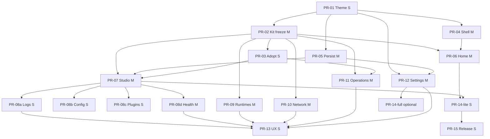

# NeoNexus UI System Redesign — v3.1 Visual System

| Field | Value |
|-------|--------|
| **Document** | UI System Redesign (v3.1) |
| **Product** | NeoNexus 3.0.0 → 3.2.0 |
| **Author** | _TBD_ |
| **Date** | 2026-07-15 |
| **Status** | Shipped: **3.1.0** (PR-01–15 + PR-14-full gate); **3.2.0** Compact single-line lists + operator walkthrough |
| **Stack** | Pure Rust · eframe/egui 0.33 · SQLite · dual GUI+CLI |
| **Repo** | the repository root |
| **Supersedes** | Partial IA + widget kit shipped in 3.0.0 (`docs/ui-v3-baseline.md`) |

---

## Overview

NeoNexus is a pure Rust native desktop workbench for Neo N3 node operations (neo-cli / neo-go / neo-rs). Version **3.0.0** already shipped a six-primary information architecture, a partial shared widget kit, theme tokens, god-state split (`session` / `fleet` / `operations_ui` / `sections` / `async_bus`), and headless UI contract tests. Operators still experience uneven density, inconsistent page chrome, one-off list/card patterns, and surfaces that feel assembled rather than designed end-to-end.

**v3.1** completes the visual and interaction system **without** leaving native egui: one type/spacing/elevation contract, shared page templates, a fully catalogued component library with explicit states, operator-grade interaction patterns (loading / empty / error / confirm / toast), surface-by-surface specs with acceptance criteria, and an incremental PR plan that freezes domain services, CLI, and SQLite schema (UI prefs only where needed). Tone remains a calm macOS-density ops workbench (Dappnode/Stereum-class clarity)—not neon or cyber.

**Minimum shippable cut line (v3.1.0):** PR-01 (tokens, Comfortable-only) → PR-02 (kit API freeze including `busy_inline`) → PR-03 (kit adoption) → PR-04 (shell, density-invariant chrome) → PR-05 (tab + density persist) → PR-06–07 (Home + Nodes Studio) → PR-14-lite (contracts) → PR-15. Parallel surfaces PR-08a–d, PR-09–12 complete the full polish track; Compact **list-row** densification stays behind a geometry proof gate (PR-14 full).

---

## Background & Motivation

### Current state (grounded in code)

| Layer | Location | What exists today |
|-------|----------|-------------------|
| Shell chrome | `src/app/frame.rs`, `src/app/views/shell/*` | Fixed panels: header **60pt**, status **28pt**, sidebar **212pt**, inventory 248 (200–340), inspector 320 (280–420), central workspace with 22×18 margins |
| Theme | `src/app/theme/{palette,tokens,style,icons}.rs` | Light/dark indigo accent; 3-tier surfaces (`window_fill` < `panel_fill` < `card_fill`); type scale 11/12/13/14/17/24; 4pt spacing XS–XL (`XL` defined but not re-exported from `theme.rs`); Phosphor Regular icons |
| Views (14 enum / 6 primary) | `src/app/view.rs`, `src/app/views.rs` | Primaries: Home, Nodes, Runtimes, Network, Operations, Settings; legacy views normalize via `normalize_navigation_for_v3` + `View::primary_nav` |
| Widgets | `src/app/widgets/*` | badges, callout, controls, filter_bar, form, layout, node_row, nodes, page_header (dead_code, unused), plugins, segmented, toolbar |
| State | `src/app/state/*` | `SessionUi`, `FleetUi`, `OperationsUi`, `WorkspaceSections`, `AsyncProbeBus`, `ToastStack` |
| Section persist | `workspace_section_flow.rs`, `lifecycle/startup/workspace_prefs.rs` | Keys `workspace.section.{operations,settings,runtimes,snapshots,monitor,federation,roles}` + shadow fields; **no** nodes tab key yet |
| Constraints | `source_quality.rs`, `native_ui_audit` | Max ~200 lines per Rust source file; **no** `ScrollArea` / `TableBuilder` / WebView / Tauri; fixed-panel + pagination model |
| Contract tests | `tests/ui_*.rs` | Geometry, typography scale, empty states, error coloring, keyboard Tab reach, dark-tier separation, optional visual truth |

### Pain points

1. **Incomplete adoption of the kit** — `page_header` is dead code; multi-section pages hand-roll segmented controls.
2. **No density preference** — Comfortable values are hard-coded in `style.rs`; Compact is not available (and must not ship unproven row heights).
3. **Uneven list patterns** — `node_row` (accent×0.18, r=10) vs journal (accent×0.14, r=8, slot 52) vs Grid tables.
4. **Weak loading UX** — `async_bus` status chips only; panels rarely show in-flight placeholders.
5. **Confirmation ad-hoc** — Delete uses danger callout + accent `primary_button` Confirm (not danger-filled).
6. **Elevation inconsistency** — Cards shadow; chrome flat; nested `form_group` ad hoc.
7. **God-state remainder** — Many filter/paging fields still on `NeoNexusApp`; out of scope unless a surface PR needs a field.

### Why now

3.0.0 locked IA and foundations. v3.1 is the polish release: one product feel end-to-end, preserve headless contracts, ship mergeable PRs that never touch domain/CLI.

---

## Goals & Non-Goals

### Goals

1. **Visual system** — Type, spacing, color roles, elevation, density (Comfortable shipped; Compact control metrics only until geometry proof), iconography, light/dark.
2. **Layout system** — Shell regions + templates T1–T6 inside fixed panels.
3. **Component library** — Catalog + frozen P0/P1 APIs (`list_row`, `confirm_bar`, `page_chrome`, `busy_inline`).
4. **Interaction patterns** — Selection, keyboard, toasts, empty/error/loading, danger confirm, primary vs secondary.
5. **IA refinements** — Keep six primaries; in-page flow only.
6. **Surface specs** — Wireframes + **acceptance** per surface (empty/error/loading, domain freezes).
7. **Accessibility & operator UX** — Keyboard-first, WCAG-ish contrast, discoverability.
8. **Implementation mapping** — Existing modules; no domain/CLI breakage.
9. **PR plan** — Ordered, sized, with minimum shippable cut line.
10. **Key decisions** — Closed product choices (no blocking open questions).

### Non-Goals

- WebView / Tauri / React migration.
- Domain services, CLI, or SQLite **domain** schema changes (UI prefs only: density, section keys).
- Full god-state extraction.
- `ScrollArea` / `TableBuilder` / virtualized tables.
- Compact **list/inventory row height** changes without a geometry proof PR.
- Focus rings on `Sense::click` list rows (egui keyboard focus on buttons remains; custom row focus is out of v3.1).
- Command palette.
- Branding redesign.

---

## Proposed Design

The design is long enough to stand on its own; it lives in
[ui-system-redesign-v3.1/proposed-design.md](ui-system-redesign-v3.1/proposed-design.md).

## Alternatives Considered

### A1 — Web UI (Tauri/React)

Rejected: product boundary + native_ui_audit.

### A2 — Expand to 14 primary nav

Rejected: 3.0.0 IA correct.

### A3 — ScrollArea for long forms

Rejected: forbidden fixed-panel model.

### A4 — Visual polish without shared templates

Rejected: re-divergence.

### A5 — Full god-state completion in 3.1

Deferred: risk vs polish.

### A6 — Kit + templates only, no density mode

| Pros | Cons |
|------|------|
| Zero geometry risk; faster 3.1.0 | Operators with large fleets cannot opt into denser **controls** |

**Chosen hybrid:** ship density preference with Comfortable default; **PR-12 required to apply Compact control metrics** (buttons/spacing/nav) so the Settings control is never a no-op; **no Compact list heights** until PR-14-full. See K5 / K25.

### A7 — Density session-only vs persisted

| Pros session-only | Pros persisted |
|-------------------|----------------|
| No SQLite key | Matches theme/inspector operator expectation |

**Chosen: persisted like theme** (K16). Settings → Storage control.

### A8 — Adopt `page_header` as-is vs segments-only chrome

| page_header as-is | segments-only |
|-------------------|---------------|
| Already written | Avoids dual titles with shell |

**Chosen: segments-only `page_chrome` with `title: None` default** (K6). Legacy `page_header` title path not used on primaries.

### A9 — Danger-styled confirm vs accent confirm

| Danger fill | Accent (today) |
|-------------|----------------|
| Clear irreversible affordance | Consistent with primary_button helper |

**Chosen: danger-filled confirm for destructive only** (K17). Cancel secondary. Non-destructive primaries stay accent.

---

## Security & Privacy Considerations

| Topic | Notes |
|-------|-------|
| Attack surface | No new network UI |
| Secrets | Wallet/import notices must use `redaction` helpers; PR-10 acceptance |
| Destructive | Danger `confirm_bar` reduces misclick |
| Paths | `short_path` on status bar |

---

## Observability

Headless UI contracts in CI; optional visual truth PNGs; repaint 500ms when busy/toasts; no new telemetry backend.

---

## Rollout Plan

1. **API freeze** after PR-02 before parallel surfaces.  
2. **Minimum shippable** through PR-07 + PR-14-lite + PR-15 without Compact list densify and without requiring all of PR-08–12.  
3. Full polish track completes PR-08a–d, 09–13.  
4. Intermediate merges may stay 3.0.x; density key ignored if rolled back.  
5. Chrome sizes never change for density.  
6. Validate: `cargo test` including `tests/ui_*.rs` each PR.

---

## Open Questions

All product blockers resolved. Remaining are non-blocking engineering notes:

| ID | Resolution |
|----|------------|
| Q1 Persist density? | **Resolved:** persist like theme; key **`appearance.ui_density`**. |
| Q1b Compact control no-op? | **Resolved:** PR-12 **must** apply Compact control metrics with the Storage UI (K25). |
| Q2 Destructive confirm style? | **Resolved:** danger-filled primary; cancel secondary. |
| Q3 Compact chrome height? | **Resolved:** never; header 60 / status 28 / sidebar 212 fixed. |
| Q4 Compact list heights? | **Resolved:** deferred; Comfortable 44/56 until geometry proof PR. |
| Q5 page_chrome titles? | **Resolved:** in-workspace segments/filters only; no shell title duplication. |
| Q6 Network section key? | **Resolved:** no extra key; use View persist keys. |
| Q7 Command palette? | **Deferred** post-3.1. |
| Q8 Field border error chrome? | Optional caption only in v3.1; full border tint if cheap later. |

---

## References

- `docs/ui-v3-baseline.md`
- `src/app/theme/*`, `frame.rs`, `view.rs`, `widgets/*`, `state/*`
- `src/app/workspace_section_flow.rs`, `lifecycle/startup/workspace_prefs.rs`
- `src/native_ui_audit/rules/forbidden.rs`, `src/source_quality.rs`
- `tests/ui_*.rs`

---

## Key Decisions

| # | Decision | Rationale |
|---|----------|-----------|
| K1 | Stay pure native egui | Product + audit boundary |
| K2 | Keep 6 primaries | 3.0 IA correct |
| K3 | Complete visual system in existing theme/widgets | Tokens already tested |
| K4 | Fixed panels + pagination | native_ui_audit |
| K5 | Comfortable default; Compact preference persisted; **list row heights not densified** until proof PR; **control metrics must apply when Compact is selected** | Geometry safety + non-noop Settings affordance |
| K6 | `page_chrome` segments-only (`title: None`) on primaries | No dual titles with shell |
| K7 | Extract `list_row_frame` + `confirm_bar` + `busy_inline` in PR-02; **`node_row` wraps `list_row_frame` in same PR** (×0.16) | Shared chrome; inventory on matrix before MS surfaces |
| K8 | Start/Stop/Restart gated to Home/Nodes/Operations; **New Node + Reload global** | Match `header/actions.rs` |
| K9 | Toasts stay status-bar chips | Geometry + peripheral vision |
| K10 | Domain/CLI/schema frozen; UI prefs only | Decouple delivery |
| K11 | 200-line files + UI contracts gate every PR | Existing quality bar |
| K12 | Indigo calm aesthetic retained | Continuity |
| K13 | Persist `NodeWorkspaceTab` via `workspace.section.nodes` + shadow field | Keys exist; mirror section machinery |
| K14 | Defer full god-state cleanup | Risk |
| K15 | One primary per action group | Predictable ops UX |
| K16 | Density persisted like theme at **`appearance.ui_density`** | Match `appearance.dark_mode` key family |
| K17 | Destructive confirm = danger fill + white text | Irreversible affordance |
| K18 | Chrome sizes density-invariant (60/28/212) | Protect `ui_geometry` |
| K19 | Selection: list ×0.16 vs egui text ×0.30 | Stop doc/impl divergence |
| K20 | Network hub: View keys only | Already works; no extra key |
| K21 | Minimum shippable = through Studio polish + contracts; split Nodes tabs PRs | Reviewable slices |
| K22 | Kit-internal SIZE_* OK; no raw sizes in `views/` | Typography integrity |
| K23 | `port_badge` is **new** P2 on `text_badge` | Honest inventory |
| K24 | Focus rings on Sense::click rows out of v3.1 | Scope control |
| K25 | Compact Settings control never ships as persist-only; PR-12 applies control metrics | Operator-visible density |
| K26 | Readiness/action-queue rows are content-height; no fixed 48pt | Match current layout; avoid clip |
| K27 | After PR-02, list selection chrome only via `list_row_frame` / `node_row` | Single selection system |

---

## PR Plan

Sizes: **S** ≤½ day, **M** 1–2 days, **L** 2–4 days. After **PR-02**, kit APIs are frozen — parallel surface PRs must not change signatures without a follow-up kit PR.

### Minimum shippable cut line

**MS-1:** PR-01 → PR-02 → PR-03 → PR-04 → PR-05 → PR-06 → PR-07 → PR-14-lite → PR-15  

Full 3.1 polish continues PR-08a–d, PR-09–13, PR-14-full.

---

### PR-01 — Theme tokens hardening & density metrics scaffold · **S**

- **Title:** `ui(theme): export XL, density metrics, tokenized layout gaps`
- **Files:** `theme/tokens.rs`, `theme/density.rs` (new), `theme/style.rs` (prepare density parameter hook; default Comfortable), `theme.rs` (export XL + density), layout helpers with `gap = 8.0` (overview, nodes, logs, plugins, alerts, wallets), unit tests for **both** Comfortable and Compact `DensityMetrics` control fields
- **Dependencies:** None
- **Description:** Comfortable metrics == current style/row heights. Compact metrics define control fields (interact_y 24, pad 10×6, spacing 8×6, nav 28) and **list heights equal Comfortable**. Unit tests for metrics table — **no** Settings UI and **no** runtime Compact apply yet (that is PR-12). Do not apply Compact in shell.

### PR-02 — Widget kit API freeze + `node_row` on matrix · **M**

- **Title:** `ui(widgets): list_row_frame, node_row×0.16, confirm_bar, page_chrome, busy_inline`
- **Files:** new `widgets/list_row.rs`, `confirm_bar.rs`, `page_chrome.rs`, `busy.rs`; **`widgets/node_row.rs`** (refactor to wrap `list_row_frame` with `Some(44|56)`, matrix ×0.16 / r=10); `widgets.rs`; `page_header.rs` (thin wrap or deprecate title path); badge SIZE_* migration optional
- **Dependencies:** PR-01
- **Description:** Implement frozen §9 APIs. **Owns the selection-matrix migration for inventory/fleet:** `node_row` must use `list_row_frame` (no ad-hoc `gamma_multiply(0.18)` after merge). `page_chrome` default title None. `confirm_bar` danger fill. `busy_inline` for later adoption. **API freeze on merge.** After this PR: no direct list-row selection fills outside `list_row_frame` / `node_row`.

### PR-03 — First non-node list adoption · **S**

- **Title:** `ui: adopt confirm_bar + list_row on delete + journal`
- **Files:** `views/nodes/selected/actions.rs`, `operations/event_journal/list.rs`
- **Dependencies:** PR-02
- **Description:** Behavioral parity; danger confirm; journal uses `list_row_frame(..., Some(52), …)` for empty-slot padding. (Inventory already on matrix via PR-02 `node_row`.)

### PR-04 — Shell polish · **M**

- **Title:** `ui(shell): spacing consistency; density-invariant chrome`
- **Files:** `frame.rs` (no exact size changes), `shell/sidebar.rs`, `header/*`, `status.rs`, `inventory/*`, `inspector/*`
- **Dependencies:** PR-01; benefits from PR-02 if inventory already on new `node_row`
- **Description:** Token spacing; chrome 60/28/212 invariant. **Do not apply Compact control metrics here** (that is PR-12). Inventory rows already use PR-02 `node_row` chrome when PR-02 merged first (recommended order: PR-02 before or with PR-04).

### PR-05 — Session: nodes tab + density persist · **M**

- **Title:** `ui(session): persist workspace.section.nodes and appearance.ui_density`
- **Files:** `state/session.rs`, `workspace_section_flow.rs` (+ KEY_NODES), `lifecycle/startup/workspace_prefs.rs`, `appearance_flow.rs`, `repository/settings_keys.rs` (`SETTING_APPEARANCE_UI_DENSITY = "appearance.ui_density"`), `repository/policies/appearance.rs` (load/save), `views/nodes/workspace.rs` (drop dead_code allows)
- **Dependencies:** PR-01
- **Description:** Shadow field + load/save for nodes tab. Density load/save like dark mode under **`appearance.ui_density`**. Persist only here is OK; **visible Compact application is PR-12** (may land density load in PR-05 defaulting Comfortable until PR-12 wires style).

### PR-06 — Home surface · **M**

- **Title:** `ui(home): triage composition; fleet via node_row`
- **Files:** `views/overview.rs`, `overview/*`
- **Dependencies:** PR-02, PR-04
- **Acceptance:** §6.1; empty CTA strings stable; domain freeze metrics; fleet uses `node_row` (already ×0.16 from PR-02) — no second selection matrix.

### PR-07 — Nodes Studio + tab chrome · **M**

- **Title:** `ui(nodes): page_chrome tabs; Studio toolbar + confirm_bar`
- **Files:** `views/nodes.rs`, `nodes/definition.rs`, `nodes/selected/*`, `nodes/layout.rs`
- **Dependencies:** PR-02, PR-03, PR-05
- **Acceptance:** §6.2 Studio; tools → `ToolbarAction`; no domain lifecycle changes.

### PR-08a — Nodes Logs · **S**

- **Title:** `ui(nodes): Logs T4 token gaps + busy hooks`
- **Files:** `views/logs/*`
- **Dependencies:** PR-07 (chrome), PR-02 (`busy_inline`)
- **Acceptance:** paging constants; empty/error; no ScrollArea.

### PR-08b — Nodes Config · **S**

- **Title:** `ui(nodes): Config template alignment`
- **Files:** `views/config/*`
- **Dependencies:** PR-07
- **Acceptance:** config read/export flows frozen.

### PR-08c — Nodes Plugins · **S**

- **Title:** `ui(nodes): Plugins list+detail chrome`
- **Files:** `views/plugins/*`
- **Dependencies:** PR-07
- **Acceptance:** empty/filter empty; pagination.

### PR-08d — Nodes Health / Monitor · **M**

- **Title:** `ui(nodes): Health process table + RPC busy_inline`
- **Files:** `views/monitor/*`
- **Dependencies:** PR-07, PR-02
- **Acceptance:** process empty CTA; busy when RPC pending; metrics domain frozen.

### PR-09 — Runtimes · **M**

- **Title:** `ui(runtimes): page_chrome sections + install busy`
- **Files:** `views/runtimes/**`, snapshots section as needed
- **Dependencies:** PR-02 (**API frozen**)
- **Acceptance:** §6.3; metric labels stable; install flows frozen.

### PR-10 — Network hub · **M**

- **Title:** `ui(network): hub chrome + empty states + redaction check`
- **Files:** `network_hub.rs`, `federation/*`, `roles/*`, `wallets/*`
- **Dependencies:** PR-02
- **Acceptance:** §6.4; **wallet notices redacted**; view-key restore only.

### PR-11 — Operations · **M**

- **Title:** `ui(operations): list_row readiness/journal; ports detail`
- **Files:** `views/operations/**` (esp. `readiness/checks.rs`, action queue, journal if not done)
- **Dependencies:** PR-02, PR-03
- **Acceptance:** §6.5; `evaluate_fleet` unchanged; readiness/action rows use `list_row_frame(..., None, …)` **content-height** (no fixed 48); journal slots 52.

### PR-12 — Settings + density UI + Compact control metrics · **M**

- **Title:** `ui(settings): page_chrome; Storage density control wired to style`
- **Files:** `views/settings/**` (Storage density UI), `theme/style.rs` / `configure_style` (accept `UiDensity`), `frame.rs` or `appearance_flow` (pass `session.density` into style each frame), alerts chrome as needed
- **Dependencies:** PR-01, PR-05
- **Acceptance:** §6.6; policies frozen. **Required (not optional):**
  1. Storage shows Comfortable / Compact control bound to `session.density` + `appearance.ui_density`.
  2. Selecting Compact **immediately** applies `DensityMetrics` control fields via `configure_style` (interact_y 24, button pad 10×6, item_spacing 8×6, nav row 28).
  3. Visible operator check: buttons/spacing denser; list/inventory heights **unchanged**; chrome 60/28/212 unchanged.
  4. Missing key / Comfortable: metrics match pre-3.1 style (28 / 14×8 / 10×8 / nav 34).

### PR-13 — UX residuals · **S**

- **Title:** `ui(ux): shortcut hint sweep; residual busy gaps`
- **Files:** `header/actions.rs`, `shortcuts/labels/*`, any surface missing busy
- **Dependencies:** Surfaces that landed (soft: after MS-1 or full track)
- **Description:** Not the first home of `busy_inline` (that is PR-02). Finish discoverability.

### PR-14-lite — Contracts for MS · **S**

- **Title:** `test(ui): assert chrome density-invariant; kit smoke`
- **Files:** `tests/ui_geometry.rs` (header 60, status 28, sidebar 212), typography, empty states
- **Dependencies:** PR-04, PR-06/07 as landed
- **Description:** No Compact force paint required for MS.

### PR-14-full — Compact geometry proof (optional track) · **M**

- **Title:** `test(ui): Compact control metrics + future list anatomy gate`
- **Files:** density unit tests, optional headless Compact shell paint, docs
- **Dependencies:** PR-12
- **Description:** Only PR allowed to change Compact list heights **after** proof. Default: still may ship Compact with Comfortable row heights.

### PR-15 — Release 3.1.0 · **S**

- **Title:** `release: NeoNexus 3.1.0 UI system`
- **Files:** `Cargo.toml`, `README.md`, `docs/ui-v3-baseline.md`
- **Dependencies:** MS-1 (PR-14-lite) at minimum
- **Description:** Version bump; document density + chrome contracts.

```mermaid
flowchart TD
  P01[PR-01 Theme S] --> P02[PR-02 Kit freeze M]
  P01 --> P04[PR-04 Shell M]
  P01 --> P05[PR-05 Persist M]
  P02 --> P03[PR-03 Adopt S]
  P02 --> P06[PR-06 Home M]
  P02 --> P07[PR-07 Studio M]
  P04 --> P06
  P05 --> P07
  P03 --> P07
  P07 --> P08a[PR-08a Logs S]
  P07 --> P08b[PR-08b Config S]
  P07 --> P08c[PR-08c Plugins S]
  P07 --> P08d[PR-08d Health M]
  P02 --> P09[PR-09 Runtimes M]
  P02 --> P10[PR-10 Network M]
  P02 --> P11[PR-11 Operations M]
  P03 --> P11
  P01 --> P12[PR-12 Settings M]
  P05 --> P12
  P06 --> P14l[PR-14-lite S]
  P07 --> P14l
  P14l --> P15[PR-15 Release S]
  P08a --> P13[PR-13 UX S]
  P08d --> P13
  P09 --> P13
  P10 --> P13
  P11 --> P13
  P12 --> P13
  P12 --> P14f[PR-14-full optional]
```

**Parallelism rule:** PR-06, PR-09, PR-10, PR-11 may run in parallel **only after PR-02 is merged and APIs frozen**. PR-08a–d parallel after PR-07.

---

*End of design document — NeoNexus UI System Redesign v3.1 (rev 3).*
